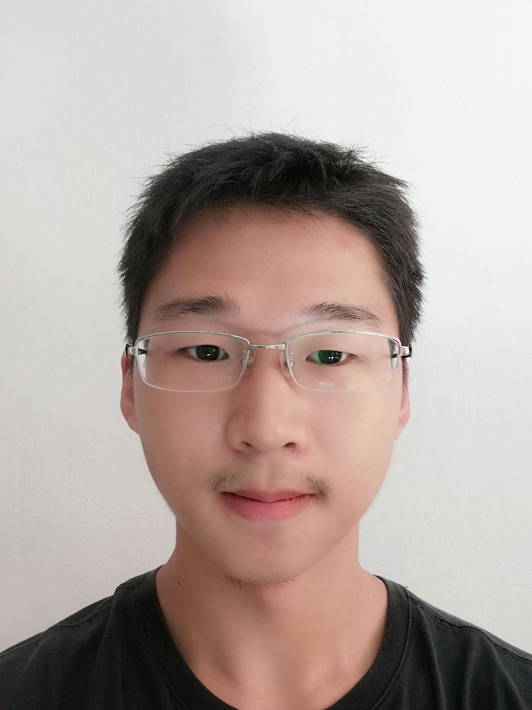
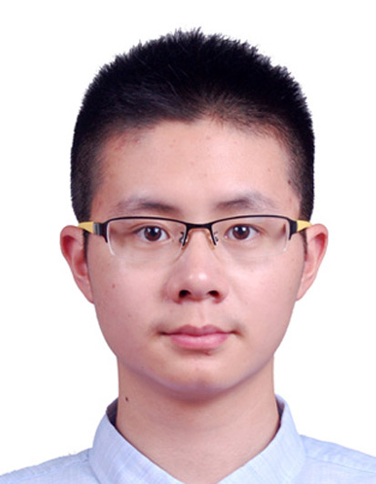
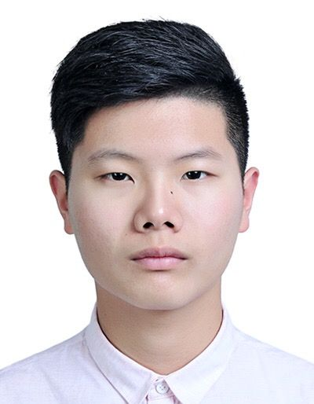
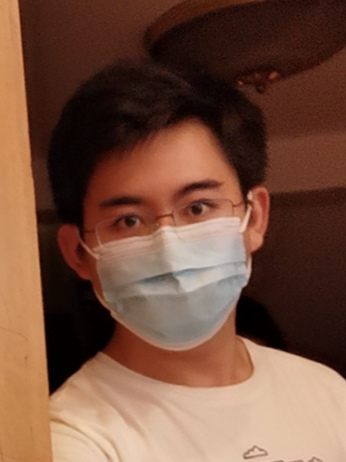

We are a team based in the [School of Computing, National University of Singapore](http://www.comp.nus.edu.sg).
This is a team project done to fulfill the requirement of Module CS2103.

## Project team

### Xu Caiyi

[[github](https://github.com/Caiyi34777)]
[[portfolio](team/caiyi34777.md)]

* Role: Developer
* Responsibilities: Documentation. In charge of Model and Logic.

### Huang Chengyu

[[github](http://github.com/HCY123902)] 
[[portfolio](team/hcy123902.md)]

* Role: Developer
* Responsibilities: Integration. In charge of Storage.

### Liu Yangming

[[github](http://github.com/richardcom)]
[[portfolio](team/richardcom.md)]

* Role: Developer
* Responsibilities: Testing. In charge of Storage.

### Jiang Siyuan

[[github](http://github.com/Stefan-Jiang)]
[[portfolio](team/stefan-jiang.md)]

* Role: Developer
* Responsibilities: Documentation & Code Quality. In charge of UI.

### Song Qifeng

[[github](http://github.com/davidsqf)] [[portfolio](team/davidsqf.md)]

* Role: Developer
* Responsibilities: Deliverable-related tasks and deadlines. In charge of Logic.
