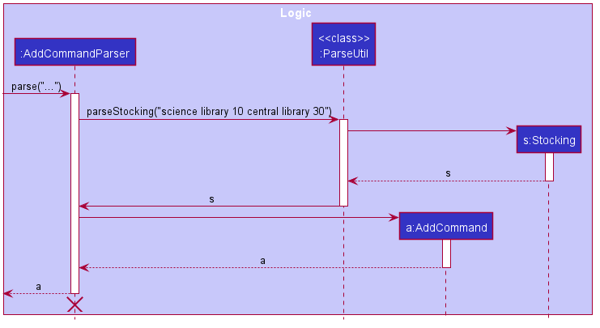

* Table of Contents
{:toc}

--------------------------------------------------------------------------------------------------------------------

## **Setting up, getting started**

Refer to the guide [_Setting up and getting started_](SettingUp.md).

--------------------------------------------------------------------------------------------------------------------

## **Design**

### Architecture

The ***Architecture Diagram*** given above explains the high-level design of the App. Given below is a quick overview of each component.

:bulb: **Tip:** The `.puml` files used to create diagrams in this document can be found in the [diagrams](https://github.com/se-edu/languagebook-level3/tree/master/docs/diagrams/) folder. Refer to the [_PlantUML Tutorial_ at se-edu/guides](https://se-education.org/guides/tutorials/plantUml.html) to learn how to create and edit diagrams.

**`Main`** has two classes called [`Main`](https://github.com/se-edu/languagebook-level3/tree/master/src/main/java/seedu/language/Main.java) and [`MainApp`](https://github.com/se-edu/languagebook-level3/tree/master/src/main/java/seedu/language/MainApp.java). It is responsible for,
* At app launch: Initializes the components in the correct sequence, and connects them up with each other.
* At shut down: Shuts down the components and invokes cleanup methods where necessary.

[**`Commons`**](#common-classes) represents a collection of classes used by multiple other components.

The rest of the App consists of four components.

* [**`UI`**](#ui-component): The UI of the App.
* [**`Logic`**](#logic-component): The command executor.
* [**`Model`**](#model-component): Holds the data of the App in memory.
* [**`Storage`**](#storage-component): Reads data from, and writes data to, the hard disk.

Each of the four components,

* defines its *API* in an `interface` with the same name as the Component.
* exposes its functionality using a concrete `{Component Name}Manager` class (which implements the corresponding API `interface` mentioned in the previous point.

For example, the `Logic` component (see the class diagram given below) defines its API in the `Logic.java` interface and exposes its functionality using the `LogicManager.java` class which implements the `Logic` interface.

**How the architecture components interact with each other**

The *Sequence Diagram* below shows how the components interact with each other for the scenario where the user issues the command `delete 1`.

The sections below give more details of each component.

### UI component

**API** :
[`Ui.java`](https://github.com/se-edu/languagebook-level3/tree/master/src/main/java/seedu/language/ui/Ui.java)

The UI consists of a `MainWindow` that is made up of parts e.g.`CommandBox`, `ResultDisplay`, `BookListPanel`, `StatusBarFooter` etc. All these, including the `MainWindow`, inherit from the abstract `UiPart` class.

The `UI` component uses JavaFx UI framework. The layout of these UI parts are defined in matching `.fxml` files that are in the `src/main/resources/view` folder. For example, the layout of the [`MainWindow`](https://github.com/se-edu/languagebook-level3/tree/master/src/main/java/seedu/language/ui/MainWindow.java) is specified in [`MainWindow.fxml`](https://github.com/se-edu/languagebook-level3/tree/master/src/main/resources/view/MainWindow.fxml)

The `UI` component,

* Executes user commands using the `Logic` component.
* Listens for changes to `Model` data so that the UI can be updated with the modified data.

### Logic component

**API** :
[`Logic.java`](https://github.com/se-edu/languagebook-level3/tree/master/src/main/java/seedu/language/logic/Logic.java)

1. `Logic` uses the `LibraryParser` class to parse the user command.
1. This results in a `Command` object which is executed by the `LogicManager`.
1. The command execution can affect the `Model` (e.g. adding a book).
1. The result of the command execution is encapsulated as a `CommandResult` object which is passed back to the `Ui`.
1. In addition, the `CommandResult` object can also instruct the `Ui` to perform certain actions, such as displaying help to the user.

Given below is the Sequence Diagram for interactions within the `Logic` component for the `execute("delete 1")` API call.

:information_source: **Note:** The lifeline for `DeleteCommandParser` should end at the destroy marker (X) but due to a limitation of PlantUML, the lifeline reaches the end of diagram.

### Model component

**API** : [`Model.java`](https://github.com/se-edu/languagebook-level3/tree/master/src/main/java/seedu/language/model/Model.java)

The `Model`,

* stores a `UserPref` object that represents the user’s preferences.
* stores the language book data.
* exposes an unmodifiable `ObservableList<Book>` that can be 'observed' e.g. the UI can be bound to this list so that the UI automatically updates when the data in the list change.
* does not depend on any of the other three components.

:information_source: **Note:** An alternative (arguably, a more OOP) model is given below. It has a `Category` list in the `Library`, which `Book` references. This allows `Library` to only require one `Category` object per unique `Category`, instead of each `Book` needing their own `Category` object. 

### Storage component

**API** : [`Storage.java`](https://github.com/se-edu/languagebook-level3/tree/master/src/main/java/seedu/language/storage/Storage.java)

The `Storage` component,
* can save `UserPref` objects in json format and read it back.
* can save the language book data in json format and read it back.

### Common classes

Classes used by multiple components are in the `seedu.addressbook.commons` package.

--------------------------------------------------------------------------------------------------------------------

## **Implementation**

This section describes some noteworthy details on how certain features are implemented.

### \[New\] DeleteBy feature

####  Implementation

The current implementation of the DeleteBy command is supported by `DeleteByCommand.java` and `DeleteByCommandParser.java` 

Given below is an example usage scenario and how the DeleteBy mechanism behaves at each step.

Step 1. User input an input: `deleteBy n/Linear Algebra`

Step 2. Logic Manager would parse the input `deleteBy n/Linear Algebra`, and determines that it is a deleteBy command.

Step 3. DeleteByParser would then parse the book name and call the deleteBy Command.

Step 4. Execution of delete would take place and the result will be updated in the filtered list in Model.

The following sequence diagram summarizes what happens when a user executes a new command:

#### Design consideration:

##### Aspect: How undo & redo executes

* **Alternative 1 :** Adopts the delete function of the original project
  * Pros: Easy to implement.
  * Cons: Not convenient for expert users and fast input.

* **Alternative 2:** Individual command of DeleteByName, DeleteByISBN, DeleteByTimes
  itself.
  * Pros: Easier to implement without the need to parse different input types.
  * Cons: A large portion of duplicated code for multiple commands.

### Enhanced Edit Command

#### Existing implementation

The existing implementation for enhanced edit command is facilitated by updated versions of `EditCommand`, `EditCommandParser`.

The relevant methods are

* `EditCommand#createEditedBook(Book, EditBookDescriptor)` —  Creates and returns a Book with the details of Book
edited with EditBookDescriptor.
* `EditCommand#EditBookDescriptor()` — Creates a EditBookDescriptor for editing a book.
* `EditCommandParser#parse(String)` — Parses the edit command created.

The relationship between the updated book (including the newly added classes) and other components is shown as below.

Given below is an example usage scenario of how the edit command will be executed, 

#### Design consideration:

The current enhancement is in alignment with other components of the book, which is easy to integrate into the product.

##### Aspect: How to enhance the edit command

* **Alternative 1 (current choice):** Adopt the original format and structure.
  * Pros: It is easier to make sure that the integration will go smoothly.
  * Cons: More efforts are required in order to adjust the newly added classes / attribute to the previous ones

* **Alternative 2:** Tweak the format of the edit command
  * Pros: The design will be more user-friendly and user-oriented.
  * Cons: There is potential risk that the modified command will not fit well into the system.

### Storing and retrieving of stocking information

#### Existing implementation

The existing implementation of the storing and retriving of stocking information is facilitated by `Stocking`, `JsonAdaptedStocking`, `StockCommand`, and `StockCommandParser`.

The relevant methods are

* `StockCommand#excecute()` — Execute the stock command according to the predicate specified by the book name and ISBN.
* `JsonAdaptedStocking#JsonAdaptedStocking(int, int)` — Reads the stocking map from the json file and also changes the storage model into the json map to store the stocking information when necessary.
* `JsonAdaptedStocking#JsonAdaptedStocking(Stocking)` — Transforms the stocking model into the json adapted model.
* `JsonAdaptedStocking#toModelType(Stocking)` — Transforms the json adapted model into the stocking model.

The relationship between the book and stocking and other components is shown as below.

These operations are incoperated into the storage read and write process in the execution.

#####Given below is an example usage scenario of how stocking information with be parsed when adding a book.

Step 1. The user launches the application and types command add with `s/science library 10 central library 30`, and the logic manager calls the language book parser, which calls the add command parser.

Step 2. The add command parser calls the ParseUtil, which parses the string and returns a stocking

Step 3. The add command parser uses the stocking and returns an add command, and this is returned by language book parser, and the logic manager executes the command and make some changes to the model.

#####Given below is an example usage scenario of how the stocking command will be executed, 

Step 1. The user types `Stock n/gun`, and the logic manager calls the language book parser, which calls the stock command parser.

Step 2. The stock command parser gets the list of book names and list of ISBN from the string and calls the constructor of the stock command to get a stock command

Step 3. The stock command is returned and executed, updating the book list shown on the user interface with the stocking information of the corresponding book.

#### Design consideration:

The current implementation of the stocking is consistent with other components of the book, which brings convenience to the program integration.

##### Aspect: How stocking executes and what the user expects

* **Alternative 1 (current choice):** Requires the user to type out the library name to specify the stocking in a location.
  * Pros: The command is clear and understandable.
  * Cons: May bring some inconvenience when typing since some of the library name is a bit long.

* **Alternative 2:** Enables the user to use abbreviation of the library location.
  * Pros: Reduces the amount of typing and brings convenience to users.
  * Cons: May cause confusion to new user because of the abbreviation of the library location.

### \[New\] ReportProblem feature

####  Implementation

The current implementation of the ReportProblem command is supported by `AddProblemCommand.java` and `AddProblemCommandParser.java` 

Given below is an example usage scenario and how the ReportProblem mechanism behaves at each step.

Step 1. User input an input: `report severity/high problem/book is broken`

Step 2. Logic Manager would parse the input `report severity/high problem/book is broken`, and determines that it is a ReportProblem command.

Step 3. AddProblemCommandParser would then parse the problem reported (both severity and problem) and call the ReportProblem Command.

Step 4. Execution of AddProblemCommand would take place and the result will be updated in the filtered list in Model.

The following sequence diagram summarizes what happens when a user executes a new command:

#### Design consideration:

##### Why the feature is implemented this way:

* To efficiently manage the reported problems, `severity` appears to be
a useful attribute to add. Therefore a `problem` has two attributes:
`severity` and `description`.

* Unlike other commands such as `edit` and `deleteBy` which 
manipulate with `book`, `ReportProblem` has no relation with
`book`, it adds `problem`. Therefore, a new model series of `problem`
is created.  

* There can be multiple problems, therefore `problem` is managed
inside a list.

* **Alternative 1 :** Link `problem` to `book`
  * What: Problems in library are often related to books, for these
  kind of book-related problems, we can store the (`problem` - `book`)
  connection/mapping inside the `problem`.
  
  * Pros: Enhances the usefulness of `ReportProblem` feature.
  * Cons: Makes the relationship between models more complex
  and may increase coupling inside the code.
  
### \[New\] ViewProblem feature

####  Implementation

The current implementation of the ViewProblem command is supported by `ViewProblemCommand.java` 

Given below is an example usage scenario and how the ViewProblem mechanism behaves at each step.

Step 1. User enters command: `view`

Step 2. Logic Manager would parse the input `view`, and determines that it is a ViewProblem command.

Step 3. Execution of ViewProblemCommand would take place.

The following sequence diagram summarizes what happens when a user executes a new command:

### \[Proposed\] Undo/redo feature

#### Proposed Implementation

The proposed undo/redo mechanism is facilitated by `VersionedLanguageBook`. It extends `LanguageBook` with an undo/redo history, stored internally as an `languageBookStateList` and `currentStatePointer`. Additionally, it implements the following operations:

* `VersionedLanguageBook#commit()` — Saves the current language book state in its history.
* `VersionedLanguageBook#undo()` — Restores the previous language book state from its history.
* `VersionedLanguageBook#redo()` — Restores a previously undone language book state from its history.

These operations are exposed in the `Model` interface as `Model#commitLanguageBook()`, `Model#undoLanguageBook()` and `Model#redoLanguageBook()` respectively.

Given below is an example usage scenario and how the undo/redo mechanism behaves at each step.

Step 1. The user launches the application for the first time. The `VersionedLanguageBook` will be initialized with the initial language book state, and the `currentStatePointer` pointing to that single language book state.

Step 2. The user executes `delete 5` command to delete the 5th book in the language book. The `delete` command calls `Model#commitLanguageBook()`, causing the modified state of the language book after the `delete 5` command executes to be saved in the `languageBookStateList`, and the `currentStatePointer` is shifted to the newly inserted language book state.

Step 3. The user executes `add n/David …​` to add a new book. The `add` command also calls `Model#commitLanguageBook()`, causing another modified language book state to be saved into the `languageBookStateList`.

:information_source: **Note:** If a command fails its execution, it will not call `Model#commitLanguageBook()`, so the language book state will not be saved into the `languageBookStateList`.

Step 4. The user now decides that adding the book was a mistake, and decides to undo that action by executing the `undo` command. The `undo` command will call `Model#undoLanguageBook()`, which will shift the `currentStatePointer` once to the left, pointing it to the previous language book state, and restores the language book to that state.

:information_source: **Note:** If the `currentStatePointer` is at index 0, pointing to the initial LanguageBook state, then there are no previous LanguageBook states to restore. The `undo` command uses `Model#canUndoLanguageBook()` to check if this is the case. If so, it will return an error to the user rather
than attempting to perform the undo.

The following sequence diagram shows how the undo operation works:

:information_source: **Note:** The lifeline for `UndoCommand` should end at the destroy marker (X) but due to a limitation of PlantUML, the lifeline reaches the end of diagram.

The `redo` command does the opposite — it calls `Model#redoLanguageBook()`, which shifts the `currentStatePointer` once to the right, pointing to the previously undone state, and restores the language book to that state.

:information_source: **Note:** If the `currentStatePointer` is at index `languageBookStateList.size() - 1`, pointing to the latest language book state, then there are no undone LanguageBook states to restore. The `redo` command uses `Model#canRedoLanguageBook()` to check if this is the case. If so, it will return an error to the user rather than attempting to perform the redo.

Step 5. The user then decides to execute the command `list`. Commands that do not modify the language book, such as `list`, will usually not call `Model#commitLanguageBook()`, `Model#undoLanguageBook()` or `Model#redoLanguageBook()`. Thus, the `languageBookStateList` remains unchanged.

Step 6. The user executes `clear`, which calls `Model#commitLanguageBook()`. Since the `currentStatePointer` is not pointing at the end of the `languageBookStateList`, all language book states after the `currentStatePointer` will be purged. Reason: It no longer makes sense to redo the `add n/David …​` command. This is the behavior that most modern desktop applications follow.

The following activity diagram summarizes what happens when a user executes a new command:

#### Design consideration:

##### Aspect: How undo & redo executes

* **Alternative 1 (current choice):** Saves the entire language book.
  * Pros: Easy to implement.
  * Cons: May have performance issues in terms of memory usage.

* **Alternative 2:** Individual command knows how to undo/redo by
  itself.
  * Pros: Will use less memory (e.g. for `delete`, just save the book being deleted).
  * Cons: We must ensure that the implementation of each individual command are correct.

_{more aspects and alternatives to be added}_

### \[Proposed\] Data archiving

_{Explain here how the data archiving feature will be implemented}_

--------------------------------------------------------------------------------------------------------------------

## **Documentation, logging, testing, configuration, dev-ops**

* [Documentation guide](Documentation.md)
* [Testing guide](Testing.md)
* [Logging guide](Logging.md)
* [Configuration guide](Configuration.md)
* [DevOps guide](DevOps.md)

--------------------------------------------------------------------------------------------------------------------

## **Appendix: Requirements**

### Product scope
**Target user profile**:
* library administrator, librarian
* has a need to manage a large number of books stored in different libraries and locations
* has a need to purchase books according to the current stock and borrow frequency
* has a need to keep track of the borrow history of books 
* has a need to collect and record the rating and review of a book from the readers anonymously
* prefer desktop apps over other types
* can type fast
* prefers typing to mouse interactions
* is reasonably comfortable using CLI apps

**Value proposition**:
* help to put books along with its related information, such as author, description, publisher, and library specific information, such as stocking location, into appropriate categories. This not only makes the searching of the book itself easier but also provides convenience for managers to track the storage and borrow history.
* help admin staff keep track of the popularity of different books, and help them predict the usage of different books to plan for book purchase
* help admin staff to keep track of books from different libraries and locate books from different libraries easily

### User stories

Priorities: High (must have) - `* * *`, Medium (nice to have) - `* *`, Low (unlikely to have) - `*`

| Priority | As a …​                                    | I want to …​                     | So that I can…​                                                        |
| -------- | ------------------------------------------ | -------------------------------- | ---------------------------------------------------------------------- |
| `* * *`  | library administrator                      | check the stocking of books in every location(e.g. central library, Hon Sui Sen Memorial Library) of each book   |efficiently increase the stockings of those very popular books to meet the demand of the readers   |
| `* *`    | library administrator                      | get an auto-generated list of most popular books in each categories                                     |know what books to purchase in the future                                                                                 |
| `* *`    | library administrator                      | view the book rating and reviews collected from the readers                    |estimate the popularity of the book among the readers and decide whether to bring in more copys of the book accroding to the reader need|
| `* *`    | library administrator                      | add, delete, and edit book rating and reviews collected from the readers                    |keep the review record for future evaluation of the book quality and popularity among the readers|
| `* *`    | library administrator                      | edit the information of a book                                                        |keep the book information in the database up to date                                                                      |
| `* * *`  | library administrator                      | report problems found in libraries along with their severities                                                |keep track of all the problems and prioritize them by their severity levels                          |
| `* * *`  | library administrator                      | view all the reported problems                                                 |know what problems need to be solved  |
| `* *`    | expert user                                | delete multiple books by condition within one command                           |it is more time efficient            |
| `* * *`  | first time user                            | view the list of sample data   | get a rough idea of how the project will look like                     |
| `* * *`  | first time user                            | see smart suggestions for the command line formats   | quickly get used to the command line formats                     |
| `* * *`  | library administrator                      | check the borrowing status of a certain book       |tell students whether they can borrow this book or not            |
| `*`  | library administrator                      | clear all data within one command       |efficiently reset the app            |
*{More to be added}*

### Use cases

(For all use cases below, the **System** is the `ItelliBrary` and the **Actor** is the `user`, unless specified otherwise)

**Use case: UC01 - Purge sample data**

**MSS**
  1. User requests to purge all sample data.
  
     Use case ends.
  
**Extensions**

* 1a. Some or all sample data had already been deleted before the 'purge' request 
    
    * 1a1. IntelliBrary deletes all remaining sample data.
    
      Use case ends.

**Use case: UC02 - Add Books**

**MSS**
  1. User request to add a new book into the library.

  2. IntelliBrary adds the book to the library and shows a successfull message to the user.
  
     Use case ends.
  
**Extensions**

* 1a. The book to be added is already found in the library.
    
    * 1a1. IntelliBrary shows an error message that the book is already stored in the library.
    
      Use case ends.

* 1b. Some information about the book is not entered in the command.

    * 1b1. IntelliBrary shows an error message that the information about the book is incomplete.

      Use case ends.
      
* 1c. The data type of some of the book information is incorrect.
    
    * 1c1. IntelliBrary shows an error message that data type of some of the book information is incorrect.
    
      Use case ends.
      
**Use case: UC03 - Delete Books**

**MSS**
  1. User request to delete a book from the library.

  2. IntelliBrary deletes the book from the library and shows a successfull message to the user.
  
     Use case ends.
  
**Extensions**

* 1a. The book to be deleted cannot be found in the library.
    
    * 1a1. IntelliBrary shows an error message that the book to be deleted cannot be found in the library.
    
      Use case ends.
            
**Use case: UC04 - view the stockings of different books**

**MSS**

1.  User request to check the stocking of a book using a command.

2.  IntelliBrary shows the relevant information of the book, including the stocking of the book.

    Use case ends.

**Extensions**

* 1a. The book name or ISBN given by the user is not found in the record.
    
    * 1a1. IntelliBrary shows an error message that the book is not found and 0 book is listed.
    
      Use case ends.

* 1b. The stocking of the book is not recorded.

    * 1b1. IntelliBrary shows that the stocking information of the book in some locations is not available.

      Use case ends.
      
**Use case: UC05 - search for the review of a book**

**MSS**

1.  User requests to search for the review of a certain book.

2.  IntelliBrary shows the review list of the book.

    Use case ends.

**Extensions**

* 1a. The book specified by the user is not found in the available books record.

    * 1a1. IntelliBrary shows an empty book list.

      Use case ends.

* 1b. The search key given by the user has an invalid format.

    * 1b1. IntelliBrary shows an error message that the entered command format is not correct and shows the examples of the correct usage of the command. 

      Use case ends.
      
**Use case: UC06 - add the review for a book**

**MSS**

1.  User requests to add a review record of a certain book.

2.  IntelliBrary adds the review to the review list of the book, and shows the new review list.

    Use case ends.

**Extensions**

* 1a. The book specified by the user is not found in the current shown book list.

    * 1a1. IntelliBrary shows an error message that the book specified is not valid.

      Use case ends.

* 1b. The review given by the user has an invalid format, with the rating or review content missing or having incorrect format or value.

    * 1b1. IntelliBrary shows an error message that the review given by the user is invalid and gives the suggestion on valid review. 

      Use case ends.

**Use case: UC07 - delete the review for a book**

**MSS**

1.  User requests to delete a review record of a certain book.

2.  IntelliBrary deletes the review to the review list of the book, and shows the updated review list.

    Use case ends.

**Extensions**

* 1a. The book specified by the user is not found in the current shown book list.

    * 1a1. IntelliBrary shows an error message that the book specified is not valid.

      Use case ends.

* 1b. The book review specified by the user is not found in the review list of the book.

    * 1a1. IntelliBrary shows an error message that the review specified is not valid.

      Use case ends.

**Use case: UC08 - edit the review for a book**

**MSS**

1.  User requests to edit a review record of a certain book.

2.  IntelliBrary edits the review to the review list of the book, and shows the updated review list.

    Use case ends.

**Extensions**

* 1a. The book specified by the user is not found in the current shown book list.

    * 1a1. IntelliBrary shows an error message that the book specified is not valid.

      Use case ends.

* 1b. The book review specified by the user is not found in the review list of the book.

    * 1a1. IntelliBrary shows an error message that the review specified is not valid.

      Use case ends.

* 1c. The new review given by the user has an invalid format, with the rating or review content missing or having incorrect format or value.

    * 1c1. IntelliBrary shows an error message that the review given by the user is invalid and gives the suggestion on valid review. 

      Use case ends.

* 1c. The new review given by the user is equivalent to the original review.

    * 1c1. IntelliBrary shows an error message that the review given by the user does not make changes to the original review and the value of the edited review needs to be different. 

      Use case ends.

**Use case UC009 - View Sample Data**

**MSS**

1.  User requests to view the sample data of the app
2.  IntelliBrary shows the information of a list of books

    Use case ends.

**Extensions**

* 2a. Sample Data is missing.

  Use case ends.
  
**Use case UC10 - Delete a book**

**MSS**

1.  User requests to list books
2.  IntelliBrary shows a list of books
3.  User requests to delete a specific book in the list
4.  IntelliBrary deletes the book

    Use case ends.

**Extensions**

* 2a. The list is empty.

  Use case ends.

* 3a. The given index is invalid.

    * 3a1. IntelliBrary shows an error message.

      Use case resumes at step 2.

**Use case: UC11 - Edit a book**

**MSS**
  1. User requests to edit a book and inputs new information.
  2. IntelliBrary modifies the current information of that book.
     Use case ends.
  
**Extensions**

* 1a. The book to be editted cannot be found.
    
    * 1a1. IntelliBrary shows an error message.
    
      Use case ends.
      
**Use case: UC12 - Check the borrowing status of a book**

**MSS**
  1. User requests to check the borrowing status of a book.
  2. IntelliBrary tells the user whether there are available stockings of this book.
  
**Extensions**

* 1a. The book to be checked cannot be found.
    
    * 1a1. IntelliBrary shows an error message.
    
      Use case ends.  
      
**Use case: UC13 - Get usage times of a book**

**MSS**
  1. User requests to get the usage times of a book and input index/book title/book isbn.
  2. IntelliBrary tells the user the usage times of the certain book.
  
**Extensions**

* 1a. The book title to be checked cannot be found.
    
    * 1a1. IntelliBrary shows an error message.
    
      Use case ends.        

* 1b. The book isbn to be checked cannot be found.
    
    * 1a1. IntelliBrary shows an error message.
    
      Use case ends.   
      
* 1c. The index is out of bound
    
    * 1a1. IntelliBrary shows an error message.
    
      Use case ends.   
      
**Use case: UC14 - Get number of books borrowed**

**MSS**
  1. User requests to get the number of books borrowed by the whole borrower cluster.
  2. IntelliBrary tells the user the number of books borrowed by the whole borrower cluster.

Use case ends.  

**Use case: UC15 - Report problem**

**MSS**
  1. User requests to report a problem.
  2. IntelliBrary adds the problem and shows a successfull message to the user.

  Use case ends. 
  
**Extensions**

* 1a. Some information about the problem is not entered in the command.

    * 1a1. IntelliBrary shows an error message that the information about the problem is incomplete.

      Use case ends.
      
* 1b. The data type of some of the problem information is incorrect.
    
    * 1b1. IntelliBrary shows an error message that data type of some of the problem information is incorrect.
    
      Use case ends.
      
**Use case: UC16 - View problems**

**MSS**
  1. User requests to view problems.
  2. IntelliBrary shows the problem list and shows a successfull message to the user.

  Use case ends.

*{More to be added}*

### Non-Functional Requirements

1.  Technical requirements: should work on any _mainstream OS_ as long as it has Java `11` or above installed.
2.  Data requirements: should be able to hold up to 1000 books without a noticeable sluggishness in performance for typical usage.
3.  Performance requirements: for core functions, the system should respond within two seconds.
4.  Quality requirements: a user with above average typing speed for regular English text (i.e. not code, not system admin commands) should be able to accomplish most of the tasks faster using commands than using the mouse.
5.  Process requirements: the project is expected to adhere to the course schedule and delivers weekly tasks on time.
6.  Domain rules: the number of books at each library cannot be less than three.

### Glossary

* **Mainstream OS**: Windows, Linux, Unix, OS-X
* **Private contact detail**: A contact detail that is not meant to be shared with others

--------------------------------------------------------------------------------------------------------------------

## **Appendix: Instructions for manual testing**

Given below are instructions to test the app manually.

:information_source: **Note:** These instructions only provide a starting point for testers to work on;
testers are expected to do more *exploratory* testing.

### Launch and shutdown

1. Initial launch

   1. Download the jar file and copy into an empty folder

   1. Double-click the jar file Expected: Shows the GUI with a set of sample contacts. The window size may not be optimum.

1. Saving window preferences

   1. Resize the window to an optimum size. Move the window to a different location. Close the window.

   1. Re-launch the app by double-clicking the jar file. 
       Expected: The most recent window size and location is retained.

1. _{ more test cases …​ }_

### Deleting a book

1. Deleting a book while all books are being shown

   1. Prerequisites: List all books using the `list` command. Multiple books in the list.

   1. Test case: `delete 1` 
      Expected: First contact is deleted from the list. Details of the deleted contact shown in the status message. Timestamp in the status bar is updated.

   1. Test case: `delete 0` 
      Expected: No book is deleted. Error details shown in the status message. Status bar remains the same.

   1. Other incorrect delete commands to try: `delete`, `delete x`, `...` (where x is larger than the list size) 
      Expected: Similar to previous.

1. _{ more test cases …​ }_

### Saving data

1. Dealing with missing/corrupted data files

   1. _{explain how to simulate a missing/corrupted file, and the expected behavior}_

1. _{ more test cases …​ }_
