* Table of Contents
{:toc}

--------------------------------------------------------------------------------------------------------------------

## **Setting up, getting started**

Refer to the guide [_Setting up and getting started_](SettingUp.md).

--------------------------------------------------------------------------------------------------------------------

## **Design**

### Architecture

The ***Architecture Diagram*** given above explains the high-level design of the App. Given below is a quick overview of each component.

:bulb: **Tip:** The `.puml` files used to create diagrams in this document can be found in the [diagrams](https://github.com/AY2021S1-CS2103-F09-3/tp/tree/master/docs/diagrams) folder. Refer to the [_PlantUML Tutorial_ at se-edu/guides](https://se-education.org/guides/tutorials/plantUml.html) to learn how to create and edit diagrams.

**`Main`** has two classes called [`Main`](https://github.com/AY2021S1-CS2103-F09-3/tp/blob/master/src/main/java/seedu/address/Main.java) and [`MainApp`](https://github.com/AY2021S1-CS2103-F09-3/tp/blob/master/src/main/java/seedu/address/MainApp.java). It is responsible for,
* At app launch: Initializes the components in the correct sequence, and connects them up with each other.
* At shut down: Shuts down the components and invokes cleanup methods where necessary.

[**`Commons`**](https://github.com/AY2021S1-CS2103-F09-3/tp/tree/master/src/main/java/seedu/address/commons) represents a collection of classes used by multiple other components.

The rest of the App consists of four components.

* [**`UI`**](#ui-component): The UI of the App.
* [**`Logic`**](#logic-component): The command executor.
* [**`Model`**](#model-component): Holds the data of the App in memory.
* [**`Storage`**](#storage-component): Reads data from, and writes data to, the hard disk.

Each of the four components,

* defines its *API* in an `interface` with the same name as the Component.
* exposes its functionality using a concrete `{Component Name}Manager` class (which implements the corresponding API `interface` mentioned in the previous point.

For example, the `Logic` component (see the class diagram given below) defines its API in the `Logic.java` interface and exposes its functionality using the `LogicManager.java` class which implements the `Logic` interface.

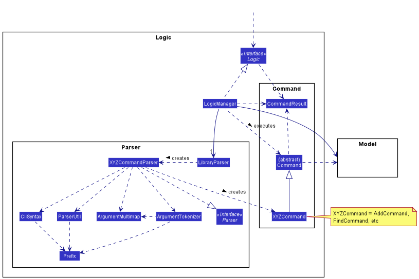

**How the architecture components interact with each other**

The *Sequence Diagram* below shows how the components interact with each other for the scenario where the user issues the command `delete 1`.

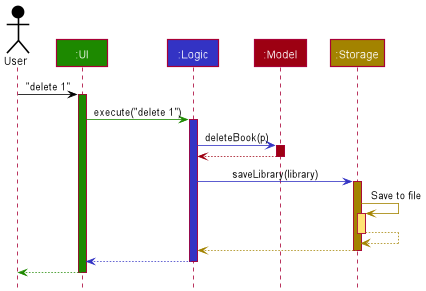

The sections below give more details of each component.

### UI component

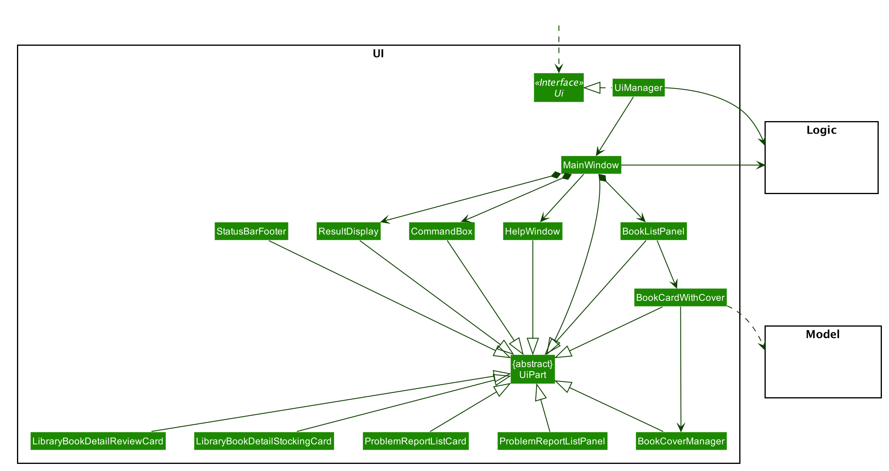

**API** :
[`Ui.java`](https://github.com/AY2021S1-CS2103-F09-3/tp/blob/master/src/main/java/seedu/address/ui/Ui.java)

The UI consists of a `MainWindow` that is made up of parts e.g.`CommandBox`, `ResultDisplay`, `BookListPanel`, `StatusBarFooter` etc. All these, including the `MainWindow`, inherit from the abstract `UiPart` class.

The `UI` component uses JavaFx UI framework. The layout of these UI parts are defined in matching `.fxml` files that are in the `src/main/resources/view` folder. For example, the layout of the [`MainWindow`](https://github.com/AY2021S1-CS2103-F09-3/tp/blob/master/src/main/java/seedu/language/ui/MainWindow.java) is specified in [`MainWindow.fxml`](https://github.com/AY2021S1-CS2103-F09-3/tp/blob/master/src/main/resources/view/MainWindow.fxml)

The `UI` component,

* Executes user commands using the `Logic` component.
* Listens for changes to `Model` data so that the UI can be updated with the modified data.

### Logic component

**API** :
[`Logic.java`](https://github.com/AY2021S1-CS2103-F09-3/tp/blob/master/src/main/java/seedu/address/logic/Logic.java)

1. `Logic` uses the `LibraryParser` class to parse the user command.
1. This results in a `Command` object which is executed by the `LogicManager`.
1. The command execution can affect the `Model` (e.g. adding a book).
1. The result of the command execution is encapsulated as a `CommandResult` object which is passed back to the `Ui`.
1. In addition, the `CommandResult` object can also instruct the `Ui` to perform certain actions, such as displaying help to the user.

Given below is the Sequence Diagram for interactions within the `Logic` component for the `execute("delete 1")` API call.

Note: The lifeline for `DeleteCommandParser` should end at the destroy marker (X) but due to a limitation of PlantUML, the lifeline reaches the end of diagram.

### Model component

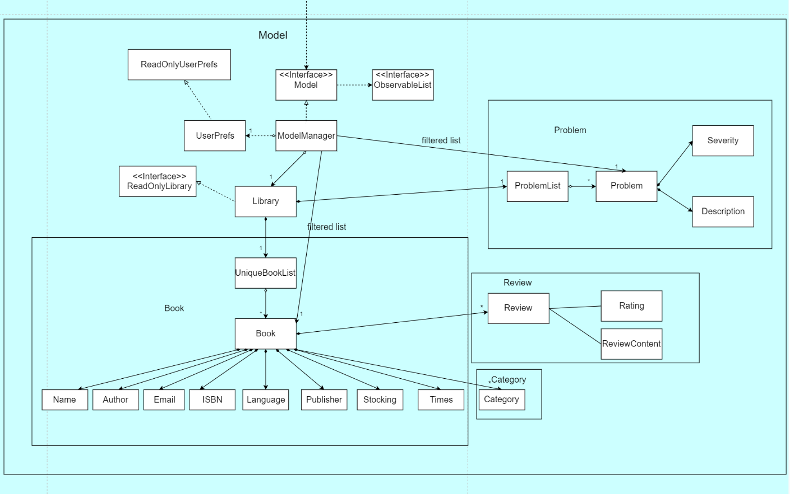

**API** : [`Model.java`](https://github.com/AY2021S1-CS2103-F09-3/tp/blob/master/src/main/java/seedu/address/model/Model.java)

The `Model`,

* stores a `UserPref` object that represents the user’s preferences.
* stores the intellibrary data.
* exposes an unmodifiable `ObservableList<Book>` that can be 'observed' e.g. the UI can be bound to this list so that the UI automatically updates when the data in the list change.
* exposes an unmodifiable `ObservableList<Problem>` that can be 'observed' e.g. the UI can be bound to this list so that the UI automatically updates when the data in the list change.
* does not depend on any of the other three components.

### Storage component

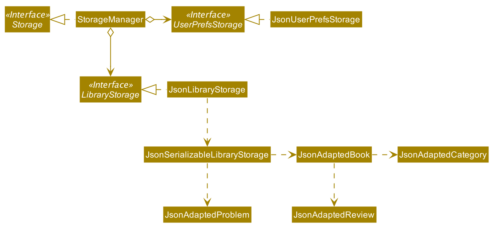

**API** : [`Storage.java`](https://github.com/AY2021S1-CS2103-F09-3/tp/blob/master/src/main/java/seedu/address/storage/Storage.java)

The `Storage` component,
* can save `UserPref` objects in json format and read it back.
* can save the intellibrary data in json format and read it back.

--------------------------------------------------------------------------------------------------------------------

## **Implementation**

This section describes some noteworthy details on how certain features are implemented.

### \[Enhanced\] Add Book feature

####  Implementation

The current implementation of the AddCommand is supported by `AddCommand.java`, `AddCommandParser.java`.

The relevant methods are:

* `AddCommandParser#parse(String args)` --- Parses the book's detailed information.
* `AddCommand#execute(Model model)` --- Checks for duplication and adds the book to the library.

Given below is an example usage scenario and how the AddCommand mechanism behaves at each step.

Step 1. User input: `add n/Linear Algebra i/98765432 e/seller@example.com l/English c/Science c/Math t/20 s/centralLb 30 scienceLb 15 HSSMLb 10 a/Victor p/pku`

Step 2. Logic Manager would parse the input `add n/Linear Algebra i/98765432 e/seller@example.com l/English c/Science c/Math t/20 s/centralLb 30 scienceLb 15 HSSMLb 10 a/Victor p/pku`, and determines that it is an Add command.

Step 3. AddCommandParser would then parse the book attributes and call the Add Command.

Step 4. Execution of Add would take place and the result will be updated in the filtered book list in Model.

The following sequence diagram summarizes what happens when a user executes a new command.(For simplicity rules mentioned in CS2103 website, 
    the diagram omits other attributes and only use book name as an example):

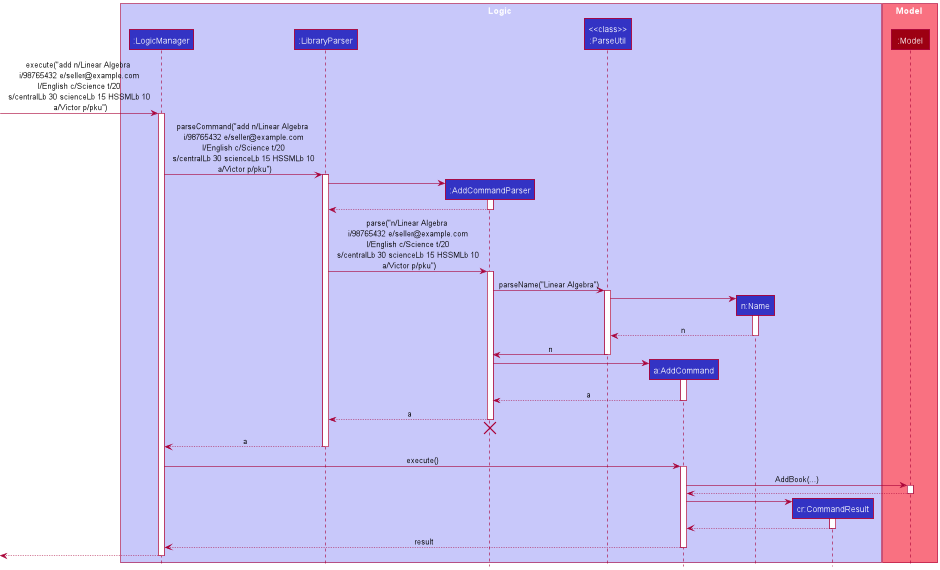

#### Design consideration:

##### Aspect: How add book command executes

* **Alternative 1:** Individual separated commands of Add author, Add publisher, Add categories, etc.
  * Pros: Easier to implement without the need to modify the original Add command.
  * Cons: Multiple commands are needed during input and it is inconvenient for users.

### \[New\] DeleteBy feature

####  Implementation

The implementation of the DeleteBy command is supported by `DeleteByCommand.java` and `DeleteByCommandParser.java` 

The relevant methods are:

* `DeleteByCommandParser#parse(String args)` --- Parses the user input: book name, ISBN, or number of borrowed times.
* `DeleteByCommand#execute(Model model)` --- Deletes the book from the library.

Given below is an example usage scenario and how the DeleteBy mechanism behaves at each step.

Step 1. User input an input: `deleteBy n/Linear Algebra`

Step 2. Logic Manager would parse the input `deleteBy n/Linear Algebra`, and determines that it is a deleteBy command.

Step 3. DeleteByCommandParser would then parse the book name and call the deleteBy Command.

Step 4. Execution of deleteBy would take place and the result will be updated in the filtered list in Model.

The following sequence diagram summarizes what happens when a user executes a new command:

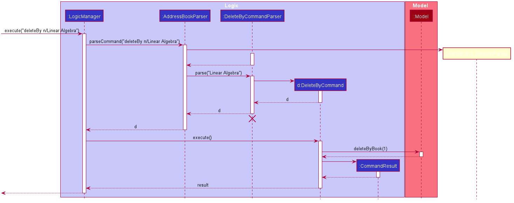

#### Design consideration:

##### Aspect: How deleteBy executes

* **Alternative 1 :** Adopts the delete function of the original AB3 project
  * Pros: Easy to implement.
  * Cons: Not convenient for expert users and fast input, does not allow deleting multiple books at a time.

* **Alternative 2:** Individual command of DeleteByName, DeleteByISBN, DeleteByTimes
  itself.
  * Pros: Easier to implement without the need to parse different input types.
  * Cons: A large portion of duplicated code for multiple commands.

### Enhanced Edit Command

#### Existing implementation

The existing implementation for enhanced edit command is facilitated by updated versions of `EditCommand`, `EditCommandParser`.

The relevant methods are

* `EditCommand#createEditedBook(Book, EditBookDescriptor)` —  Creates and returns a Book with the details of Book
edited with EditBookDescriptor.
* `EditCommand#EditBookDescriptor()` — Creates a EditBookDescriptor for editing a book.
* `EditCommandParser#parse(String)` — Parses the edit command created.

The relationship between the updated book (including the newly added classes) and other components is shown as below.

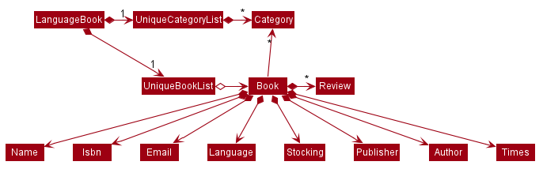

Given below is an example usage scenario of how the edit command will be executed, 

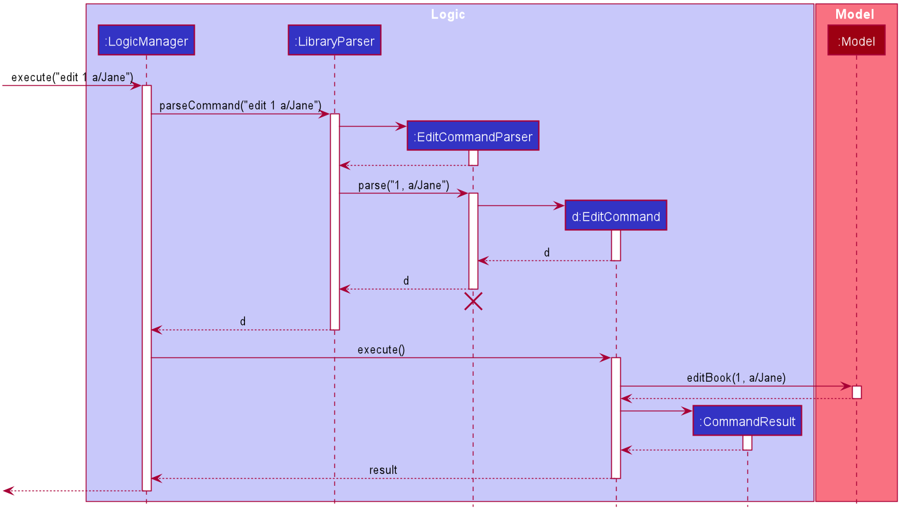

:information_source: **Note:** The lifeline for `DeleteCommandParser` should end at the destroy marker (X) but due to a limitation of PlantUML, the lifeline reaches the end of diagram.

#### Design consideration:

The current enhancement is in alignment with other components of the book, which is easy to integrate into the product.

#### Aspect: How to enhance the edit command

* **Alternative 1 (current choice):** Adopt the original format and structure.
  * Pros: It is easier to make sure that the integration will go smoothly.
  * Cons: More efforts are required in order to adjust the newly added classes / attributes to the previous ones.

* **Alternative 2:** Tweak the format of the edit command
  * Pros: The design will be more user-friendly and user-oriented.
  * Cons: There is potential risk that the modified command will not fit well into the system.

### Storing and retrieving of stocking information

#### Existing implementation

The existing implementation of the storing and retrieving of stocking information is facilitated by `Stocking`, `JsonAdaptedStocking`, `StockCommand`, and `StockCommandParser`.

The relevant methods are

* `StockCommand#excecute()` — Execute the stock command according to the predicate specified by the book name and ISBN.
* `JsonAdaptedStocking#JsonAdaptedStocking(int, int)` — Reads the stocking map from the json file and also changes the storage model into the json map to store the stocking information when necessary.
* `JsonAdaptedStocking#JsonAdaptedStocking(Stocking)` — Transforms the stocking model into the json adapted model.
* `JsonAdaptedStocking#toModelType(Stocking)` — Transforms the json adapted model into the stocking model.

The relationship between the book and the stocking and other components

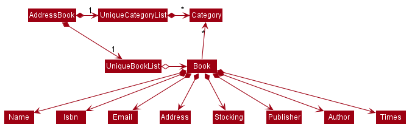

These operations are incorporated into the storage read and write process in the execution.

##### Given below is an example usage scenario of how stocking information with be parsed when editing a book.

The diagram describes the process in Step 2 and Step 3. 

Step 1. The user launches the application and types command `edit 1 s/scienceLb 10 centralLb 30`, and the logic manager calls the library parser, which calls the edit command parser.

Step 2. The edit command parser calls the ParseUtil, which parses the string and returns a stocking

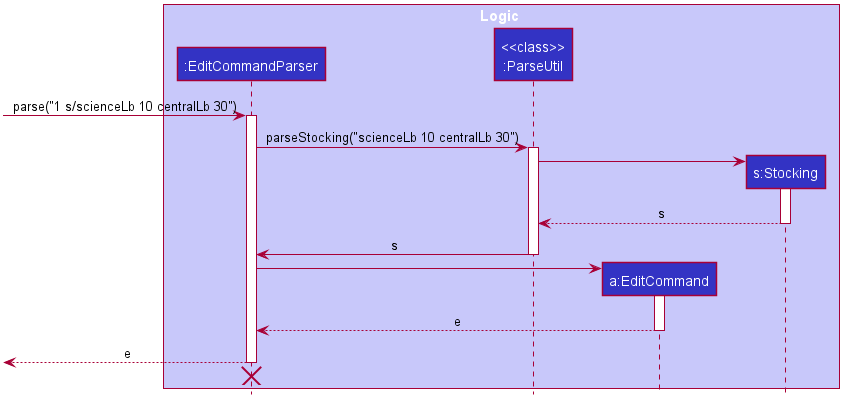

Step 3. The edit command parser uses the stocking and returns an edit command, and this is returned by library parser. 

Step 4. The edit command is executed and the stocking of the original book in the model will be updated.

##### Given below is an example usage scenario of how the stocking command will be executed. 

The diagram describes the process in Step 2.

Step 1. The user types `Stock n/Guns`, and the logic manager calls the library parser, which calls the stock command parser.

Step 2. The stock command parser parses the string into a list of name keywords and a list of ISBN number and calls the constructor of the stock command to get a stock command. In the diagram, the constructor of the stock command will take in 2 lists. The first list, corresponding to the name keywords, contains a single element `Guns`, and the second list, corresponding to the ISBN number, is an empty list.

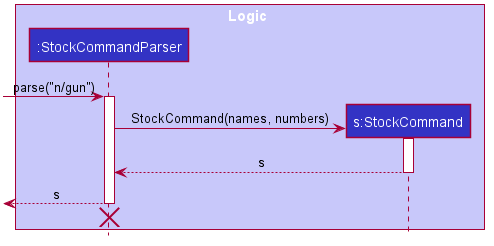

Step 3. The stock command is returned and executed, updating the book list shown on the user interface with the stocking information of the corresponding book.

#### Design consideration:

The current implementation of the stocking is consistent with other components of the book, which brings convenience to the program integration.

#### Aspect: How stocking executes and what the user expects

* **Alternative 1 (current choice):** Requires the user to type out the library name to specify the stocking in a location.
  * Pros: The command is clear and understandable.
  * Cons: May bring some inconvenience when typing since some of the library name is a bit long.

* **Alternative 2:** Enables the user to use abbreviation of the library location.
  * Pros: Reduces the amount of typing and brings convenience to users.
  * Cons: May cause confusion to new user because of the abbreviation of the library location.
  
### Reviewing of a book

#### Existing implementation

The existing implementation of the review uses `Review`, `JsonAdaptedReview` and other related objects.

The class diagram for `Review`

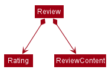

##### Given below is an example usage scenario of adding a review to a book.

The diagram describes the process in Step 2.

Step 1. The user launches the application and types command `addReview 1 ra/5 re/Make review`, and the logic manager calls the library parser, which calls the add review command parser.

Step 2. The add review command parser calls the ParseUtil, which parses the string and returns the `Rating` and `ReviewContent` respectively, and the add review command parser will use the `Rating` and `ReviewContent` to create a new review. The add review command will be created using this new review.

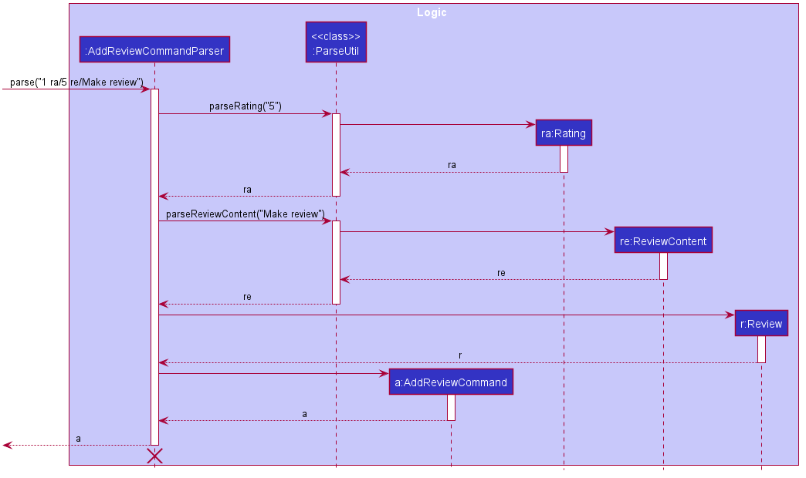

Step 3. The add review command parser returns an add review command, and this is returned by library parser.

Step 4. The add review command is executed, which adds the review with the rating `5` and the review content `Make review` the book with index `1` shown in the current book list.

##### Given below is an example usage scenario of editing a review of a book.

Step 1. The user launches the application and types command `editReview 1 rn/4 ra/5 re/Make review`, and the logic manager calls the library parser, which calls the edit review command parser.

Step 2. The edit review command parser calls the ParseUtil and other methods to get the book index, `ReviewNumber`, new `Rating`, and new `ReviewContent`.

Step 3. The edit review command parser returns an edit review command with a new `Rating` object of rating `5` and a new `ReviewContent` object with review content `Make review`.

Step 4. The edit review command is executed and updates the review at position `4` in the review list of the book with index `1` in the currently shown book list.

##### Given below is description of the process of deleting a book using deleteReview .

The process is similar to edit review command.

The difference is that in Step 2, the delete review command parser will only parse the index of the book and the review number of the review to delete, which will be used to create a delete command.

In Step 4, the execution of the delete command deletes the review from the review list of the book in the currently shown book list according to the book index and review number.

##### Given below is description of the process of searching for certain books using searchReview.

Please refer to the stock command because the execution process is similar to execution process of a stock command.

#### Design consideration:

The current implementation of the reviewing is consistent with other components of the book, which brings convenience to the program integration.

#### Aspect: What is the length of the review content

* **Alternative 1 (current choice):** Requires the user to type no more than 300 characters in the review.
  * Pros: The review is more concise, which will make it more convenient for the librarian to summarize the review.
  * Cons: May bring inconvenience for recording the thoughts of some readers in detail.

* **Alternative 2:** Remove the length restriction
  * Pros: Allows the thoughts to be recorded in detail.
  * Cons: May cause inconvenience for recording and summarizing the review.

### \[New\] Find the most popular book feature

####  Implementation

The implementation of the FindMostPopular command is supported by `FindMostPopularCommand.java` and `FindMostPopularCommandParser.java` 

The relevant methods are:

* `FindMostPopularCommandParser#parse(String args)` --- Parses the input into book category.
* `FindMostPopularCommand#execute(Model model)` --- Finds the most popular book of the specified category and updates the filtered book list.

Given below is an example usage scenario and how the FindMostPopular mechanism behaves at each step.

Step 1. User input an input: `findpop Science`

Step 2. Logic Manager would parse the input `findpop Science`, and determines that it is a findpop command.

Step 3. FindMostPopularCommandParser would then parse the category type and call the findpop Command.

Step 4. Execution of findpop would take place. The most popular book(borrowed the most number of times) will be found
 and the result will be updated in the filtered list in Model.

The following sequence diagram summarizes what happens when a user executes a new command:

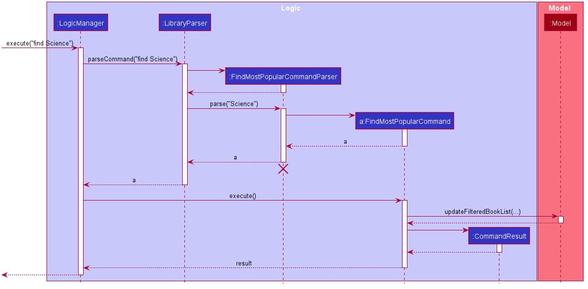

#### Design consideration:

#### Aspect: How find Most Popular executes

* **Alternative 1 :** Stores the most popular book as an attribute of each category
  * Pros: Easy to retrieve the most popular book.
  * Cons: Needs auto-refresh when the borrowed times of different books change.

* **Alternative 2:** Return the most popular book found directly to the UI
  * Pros: Easier to implement.
  * Cons: Does not follow the abstraction layers of UI.

### \[New\] Randomized selection of book feature

####  Implementation

The implementation of the Random command is supported by `RandomCommand.java` and `RandomCommandParser.java` 

The relevant methods are:

* `RandomCommandParser#parse(String args)` --- Parses the input into book category.
* `RandomCommand#execute(Model model)` --- Randomly selects a book of the specified category and updates the filtered book list.

Given below is an example usage scenario and how the Random mechanism behaves at each step.

Step 1. User input an input: `random Classics`

Step 2. Logic Manager would parse the input `random Classics`, and determines that it is a Random command.

Step 3. RandomCommandParser would then parse string input and call the Random Command.

Step 4. Execution of Random would take place. A randomly selected book of the specified category will be found
 and the result will be updated in the filtered list in Model.

The following sequence diagram summarizes what happens when a user executes a new command:

#### Design consideration:

##### Aspect: How randomly select a book executes

* **Alternative 1 :** Randomly select a book from the current filtered list.
  * Pros: Easy to implement with the current filteredBookList.
  * Cons: Tedious and inconvenient when users want to randomly select a book of a certain category.

### \[New\] ReportProblem feature

####  Implementation

The current implementation of the ReportProblem command is supported by `AddProblemCommand.java` and `AddProblemCommandParser.java` 

Given below is an example usage scenario and how the ReportProblem mechanism behaves at each step.

Step 1. User input an input: `report s/high d/book is broken`

Step 2. Logic Manager would parse the input `report s/high d/book is broken`, and determines that it is a ReportProblem command.

Step 3. AddProblemCommandParser would then parse the problem reported (both severity and description) and call the ReportProblem Command.

Step 4. Execution of AddProblemCommand would take place and the result will be updated in the filtered list in Model.

The following sequence diagram summarizes what happens when a user executes a new command:

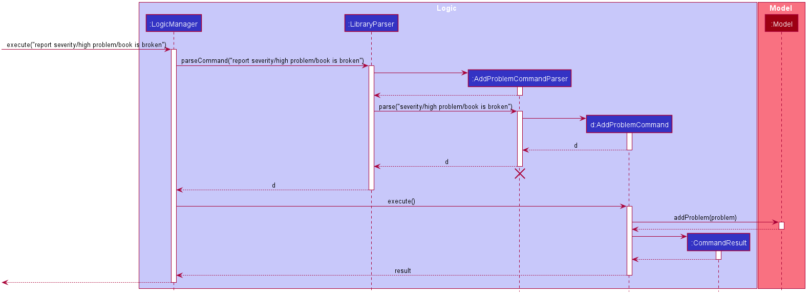

#### Design consideration:

##### Why the feature is implemented this way:

* To efficiently manage the reported problems, `severity` appears to be
a useful attribute to add. Therefore a `problem` has two attributes:
`severity` and `description`.

* Unlike other commands such as `edit` and `deleteBy` which 
manipulate with `book`, `ReportProblem` has no relation with
`book`, it adds `problem`. Therefore, a new model series of `problem`
is created.  

* There can be multiple problems, therefore `problem` is managed
inside a list.

* **Alternative 1 :** Link `problem` to `book`
  * What: Problems in library are often related to books, for these
  kind of book-related problems, we can store the (`problem` - `book`)
  connection/mapping inside the `problem`.
  
  * Pros: Enhances the usefulness of `ReportProblem` feature.
  * Cons: Makes the relationship between models more complex
  and may increase coupling inside the code.
  
### \[New\] ViewProblem feature

####  Implementation

The current implementation of the ViewProblem command is supported by `ViewProblemCommand.java` 

Given below is an example usage scenario and how the ViewProblem mechanism behaves at each step.

Step 1. User enters command: `view`

Step 2. Logic Manager would parse the input `view`, and determines that it is a ViewProblem command.

Step 3. Execution of ViewProblemCommand would take place.

The following sequence diagram summarizes what happens when a user executes a new command:

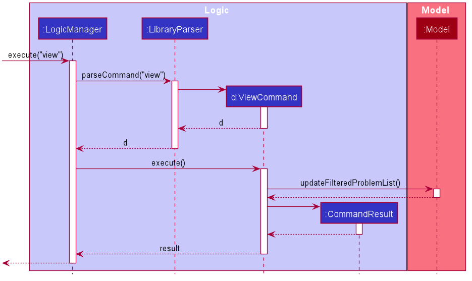

### \[New\] Edit Problem Report feature

####  Implementation

The implementation of the Edit Problem Report command is supported by `EditProblemCommand.java` and `EditProblemCommandParser.java` 

The relevant methods are:

* `EditProblemCommandParser#parse(String args)` --- Parses the user input arguments.
* `EditProblemCommand#execute(Model model)` --- Edits the book with the user input and updates the book list of the library.

Below is the diagram illustrating the Problem Report Model. The EditProblemCommand allows for edit of either one attribute
or both attributes at the same time.

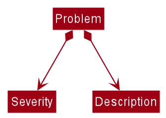

Given below is an example usage scenario and how the edit problem report mechanism behaves at each step.

Step 1. User input an input: `editpr 2 s/high d/light at the first floor is broken`

Step 2. Logic Manager would parse the input `editpr 2 s/high d/light at the first floor is broken`, and determines that it is a EditProblemCommand command.

Step 3. EditProblemCommandParser would then parse string input and call the EditProblemCommand.

Step 4. Execution of EditProblemCommand would take place. The report at the specified index will be edited
and updated according to user input.

The following sequence diagram summarizes what happens when a user executes a new command:

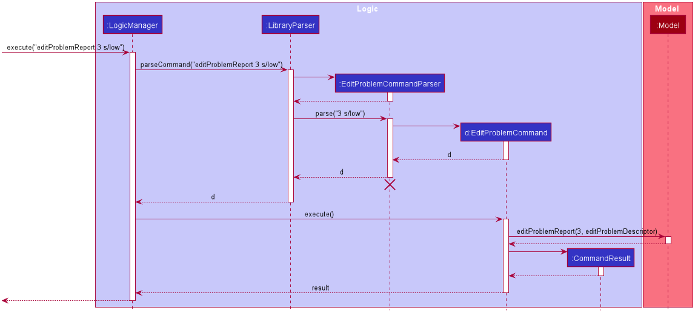

### \[New\] Find Problem Report feature

####  Implementation

The implementation of the Find Problem Report command is supported by `FindProblemCommand.java` and `FindProblemCommandParser.java` 

The relevant methods are:

* `FindProblemCommandParser#parse(String args)` --- Parses the user input arguments.
* `FindProblemCommand#execute(Model model)` --- Finds the problem report which has the description that matches the user input.

Given below is an example usage scenario and how the find problem report mechanism behaves at each step.

Step 1. User input an input: `findpr chair`

Step 2. Logic Manager would parse the input `findpr chair`, and determines that it is a FindProblemCommand command.

Step 3. FindProblemCommandParser would then parse string input and call the FindProblemCommand.

Step 4. Execution of FindProblemCommand would take place. The problems reports which has the description containing the keywords
will be displayed.

The following sequence diagram summarizes what happens when a user executes a new command:

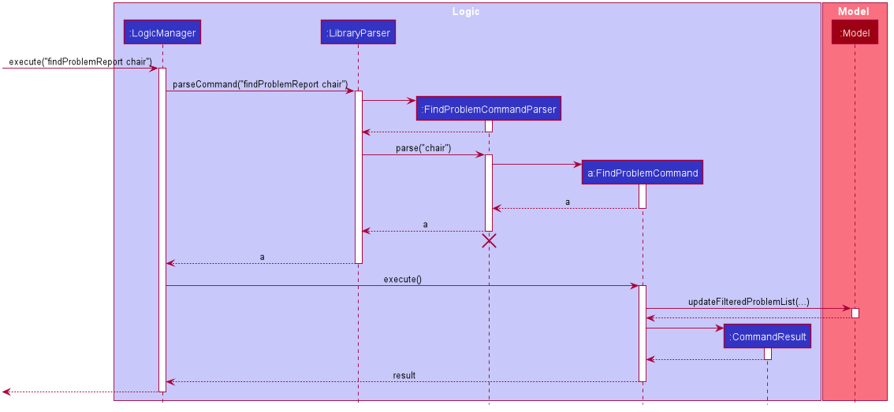

### \[New\] Delete Problem Report feature

####  Implementation

The implementation of the DeleteProblem command is supported by `DeleteProblemCommand.java` and `DeleteProblemCommandParser.java` 

The relevant methods are:

* `DeleteProblemCommandParser#parse(String args)` --- Parses the user input index.
* `DeleteProblemCommand#execute(Model model)` --- Deletes the report of the input index from the library.

Given below is an example usage scenario and how the delete problem report mechanism behaves at each step.

Step 1. User input an input: `deletepr 2`

Step 2. Logic Manager would parse the input `deletepr 2`, and determines that it is a deleteProblem command.

Step 3. DeleteProblemCommandParser would parse the index of the report to be deleted.

Step 4. Execution of DeleteProblem would take place and the result will be updated in the filtered list in Model.

--------------------------------------------------------------------------------------------------------------------

## **Documentation, logging, testing, configuration, dev-ops**

* [Documentation guide](Documentation.md)
* [Testing guide](Testing.md)
* [Logging guide](Logging.md)
* [Configuration guide](Configuration.md)
* [DevOps guide](DevOps.md)

--------------------------------------------------------------------------------------------------------------------

## **Appendix: Requirements**

### Product scope
**Target user profile**:
* library administrator, librarian
* has a need to manage a large number of books stored in different libraries and locations
* has a need to purchase books according to the current stock and borrow frequency
* has a need to keep track of the borrow history of books 
* has a need to collect and record the rating and review of a book from the readers anonymously
* prefer desktop apps over other types
* can type fast
* prefers typing to mouse interactions
* is reasonably comfortable using CLI apps

**Value proposition**:
* help to put books along with its related information, such as author, description, publisher, and library specific information, such as stocking location, into appropriate categories. This not only makes the searching of the book itself easier but also provides convenience for managers to track the storage and borrow history.
* help admin staff keep track of the popularity of different books, and help them predict the usage of different books to plan for book purchase
* help admin staff to keep track of books from different libraries and locate books from different libraries easily

### User stories

Priorities: High (must have) - `* * *`, Medium (nice to have) - `* *`, Low (unlikely to have) - `*`

<table>
<thead>
<tr>
<th>Priority</th>
<th>As a …​</th>
<th>I want to …​</th>
<th>So that I can…​                                                        </th>
</tr>
</thead>
<tbody>
<tr>
<td><code>* * *</code></td>
<td>library administrator</td>
<td>add new books or delete original books in the library</td>
<td>keep in the information in IntelLibrary application up to date  </td>
</tr>
<tr>
</tr>
<tr>
<td><code>* * *</code></td>
<td>library administrator</td>
<td>delete all unpopular books at a time</td>
<td>efficiently keep the record up to date and cleans unpopular books from the system efficiently  </td>
</tr>
<tr>
</tr>
<tr>
<td><code>* * *</code></td>
<td>library administrator</td>
<td>check the stocking of books in every location(e.g. Central library, Hon Sui Sen Memorial Library) of each book</td>
<td>efficiently increase the stockings of those very popular books to meet the demand of the readers   </td>
</tr>
<tr>
</tr>
<tr>
<td><code>* *</code></td>
<td>library administrator</td>
<td>get the most popular book in each category</td>
<td>know what books to purchase in the future        </td>
</tr>
<tr>
</tr>
<tr>
<td><code>* *</code></td>
<td>library administrator</td>
<td>view the book rating and reviews collected from the readers</td>
<td>estimate the popularity of the book among the readers and decide whether to bring in more copies of the book according to the reader need</td>
</tr>
<tr>
</tr>
<tr>
<td><code>* *</code></td>
<td>library administrator</td>
<td>add, delete, and edit book rating and reviews collected from the readers</td>
<td>keep the review record for future evaluation of the book quality and popularity among the readers</td>
</tr>
<tr>
</tr>
<tr>
<td><code>* *</code></td>
<td>library administrator</td>
<td>edit the information of a book</td>
<td>keep the book information in the database up to date                                                                      </td>
</tr>
<tr>
</tr>
<tr>
<td><code>* *</code></td>
<td>library administrator</td>
<td>get a randomly selected book from specified category at a time</td>
<td>easier to implement random sampling for library book data analysis  </td>
</tr>
<tr>
</tr>
<tr>
<td><code>* * *</code></td>
<td>library administrator</td>
<td>report, delete problems found in libraries along with their severities</td>
<td>keep track of and update the problems and prioritize them by their severity levels                          </td>
</tr>
<tr>
</tr>
<tr>
<td><code>* * *</code></td>
<td>library administrator</td>
<td>view all the reported problems</td>
<td>know what problems need to be solved  </td>
</tr>
<tr>
</tr>
<tr>
<td><code>* * *</code></td>
<td>library administrator</td>
<td>edit the information of reported problems</td>
<td>keep the report information in record up to date  </td>
</tr>
<tr>
</tr>
<tr>
<td><code>* * *</code></td>
<td>library administrator</td>
<td>get the report which description contains keywords</td>
<td>fast access and find relevant problems at a time </td>
</tr>
<tr>
</tr>
<tr>
<td><code>* *</code></td>
<td>expert user</td>
<td>delete multiple books by condition within one command</td>
<td>it is more time efficient            </td>
</tr>
<tr>

</tr>
<tr>
<td><code>* * *</code></td>
<td>first time user</td>
<td>view the list of sample data</td>
<td>get a rough idea of how the project will look like                     </td>
</tr>
<tr>
</tr>
<tr>
<td><code>* * *</code></td>
<td>first time user</td>
<td>see smart suggestions for the command line formats</td>
<td>quickly get used to the command line formats                     </td>
</tr>
<tr>
</tr>
<tr>
<td><code>* * *</code></td>
<td>library administrator</td>
<td>check the borrowing status of a certain book</td>
<td>tell students whether they can borrow this book or not            </td>
</tr>
<tr>
</tr>
<tr>
<td><code>* *</code></td>
<td>library administrator</td>
<td>clear all data within one command</td>
<td>efficiently reset the app            </td>
</tr>
<tr>
</tr>
</tbody>
</table>

<em>{More to be added}</em>

### Use cases

(For all use cases below, the **System** is the `ItelliBrary` and the **Actor** is the `user`, unless specified otherwise)

**Use case: UC01 - Add a book**

**MSS**
  1. User request to add a new book into the library.

  2. IntelliBrary adds the book to the library and shows a successful message to the user.
  
     Use case ends.
  
**Extensions**

* 1a. The book to be added is already found in the library.
    
    * 1a1. IntelliBrary shows an error message that the book is already stored in the library.
    
      Use case ends.

* 1b. Some information about the book is not entered in the command.

    * 1b1. IntelliBrary shows an error message that the information about the book is incomplete.

      Use case ends.
      
* 1c. The data type of some of the book information is incorrect.
    
    * 1c1. IntelliBrary shows an error message that data type of some of the book information is incorrect.
    
      Use case ends.
            
**Use case: UC02 - View the stockings of different books**

**MSS**

1.  User request to check the stocking of a book using a command.

2.  IntelliBrary shows the relevant information of the book, including the stocking of the book.

    Use case ends.

**Extensions**

* 1a. The book name or ISBN given by the user is not found in the record.
    
    * 1a1. IntelliBrary shows an error message that the book is not found and 0 book is listed.
    
      Use case ends.

* 1b. The stocking of the book is not recorded.

    * 1b1. IntelliBrary shows that the stocking information of the book in some locations is not available.

      Use case ends.
      
**Use case: UC03 - Search for the review of a book**

**MSS**

1.  User requests to search for the review of a certain book.

2.  IntelliBrary shows the review list of the book.

    Use case ends.

**Extensions**

* 1a. The book specified by the user is not found in the available books record.

    * 1a1. IntelliBrary shows an empty book list.

      Use case ends.

* 1b. The search key given by the user has an invalid format.

    * 1b1. IntelliBrary shows an error message that the entered command format is not correct and shows the examples of the correct usage of the command. 

      Use case ends.
      
**Use case: UC04 - Add the review for a book**

**MSS**

1.  User requests to add a review record of a certain book.

2.  IntelliBrary adds the review to the review list of the book, and shows the new review list.

    Use case ends.

**Extensions**

* 1a. The book specified by the user is not found in the current shown book list.

    * 1a1. IntelliBrary shows an error message that the book specified is not valid.

      Use case ends.

* 1b. The review given by the user has an invalid format, with the rating or review content missing or having incorrect format or value.

    * 1b1. IntelliBrary shows an error message that the review given by the user is invalid and gives the suggestion on valid review. 

      Use case ends.

**Use case: UC05 - Delete a review for a book**

**MSS**

1.  User requests to delete a review record of a certain book.

2.  IntelliBrary deletes the review to the review list of the book, and shows the updated review list.

    Use case ends.

**Extensions**

* 1a. The book specified by the user is not found in the current shown book list.

    * 1a1. IntelliBrary shows an error message that the book specified is not valid.

      Use case ends.

* 1b. The book review specified by the user is not found in the review list of the book.

    * 1a1. IntelliBrary shows an error message that the review specified is not valid.

      Use case ends.

**Use case: UC06 - Edit the review for a book**

**MSS**

1.  User requests to edit a review record of a certain book.

2.  IntelliBrary edits the review to the review list of the book, and shows the updated review list.

    Use case ends.

**Extensions**

* 1a. The book specified by the user is not found in the current shown book list.

    * 1a1. IntelliBrary shows an error message that the book specified is not valid.

      Use case ends.

* 1b. The book review specified by the user is not found in the review list of the book.

    * 1a1. IntelliBrary shows an error message that the review specified is not valid.

      Use case ends.

* 1c. The new review given by the user has an invalid format, with the rating or review content missing or having incorrect format or value.

    * 1c1. IntelliBrary shows an error message that the review given by the user is invalid and gives the suggestion on valid review. 

      Use case ends.

* 1d. The new review given by the user is equivalent to the original review.

    * 1c1. IntelliBrary shows an error message that the review given by the user does not make changes to the original review and the value of the edited review needs to be different. 

      Use case ends.

**Use case UC07 - Delete a book**

**MSS**

1.  User requests to list books
2.  IntelliBrary shows a list of books
3.  User requests to delete a specific book in the list
4.  IntelliBrary deletes the book

    Use case ends.

**Extensions**

* 2a. The list is empty.

  Use case ends.

* 3a. The given index is invalid.

    * 3a1. IntelliBrary shows an error message.

      Use case resumes at step 2.

**Use case: UC08 - Edit a book**

**MSS**

1.  User requests to list books
2.  IntelliBrary shows a list of books
3.  User requests to edit the information of a specific book in the list
4.  IntelliBrary edits the book

    Use case ends.

**Extensions**

* 2a. The list is empty.

  Use case ends.

* 3a. The given command format is invalid.

    * 3a1. IntelliBrary reminds the user of incorrect command format.

      Use case resumes at step 2.
      
**Use case: UC09 - Get usage times of a book**

**MSS**
  1. User requests to get the usage times of a book and input index/book title/book isbn.
  2. IntelliBrary tells the user the usage times of the certain book.
  
**Extensions**

* 1a. The book title to be checked cannot be found.
    
    * 1a1. IntelliBrary shows an error message.
    
      Use case ends.        

* 1b. The book isbn to be checked cannot be found.
    
    * 1a1. IntelliBrary shows an error message.
    
      Use case ends.   
      
* 1c. The index is out of bound
    
    * 1a1. IntelliBrary shows an error message.
    
      Use case ends.   
      
**Use case: UC10 - Get number of books borrowed**

**MSS**
  1. User requests to get the number of books borrowed by the whole borrower cluster.
  2. IntelliBrary tells the user the number of books borrowed by the whole borrower cluster.

Use case ends.  

**Use case: UC11 - Report a problem**

**MSS**
  1. User requests to report a problem.
  2. IntelliBrary adds the problem and shows a successful message to the user.

  Use case ends. 
  
**Extensions**

* 1a. Some information about the problem is not entered in the command.

    * 1a1. IntelliBrary shows an error message that the information about the problem is incomplete.

      Use case ends.
      
* 1b. The data type of some of the problem information is incorrect.
    
    * 1b1. IntelliBrary shows an error message that data type of some of the problem information is incorrect.
    
      Use case ends.
      
* 1c. The newly reported problems has the same description with an existing problem.

    * 1c1. IntelliBrary shows a message that duplicate problem is detected.
    
      Use case ends.
      
**Use case: UC12 - View a problem**

**MSS**
  1. User requests to view problems.
  2. IntelliBrary shows the problem list and shows a successful message to the user.

  Use case ends.
  
**Use case: UC13 - Delete a problem report**

**MSS**
  1. User requests to delete a problem report by index.
  2. IntelliBrary deletes the problem report and shows a successful message to the user.

  Use case ends. 
  
**Extensions**

* 1a. The index given by the user is invalid.

    * 1a1. IntelliBrary shows an error message that index given by the user is invalid.

      Use case ends.
    
    
**Use case: UC14 - Find a problem report by description**

**MSS**
  1. User requests to find reports that the descriptions matches certain keywords.
  2. IntelliBrary returns the reports whose descriptions match the keywords.

  Use case ends. 
  
**Extensions**

* 1a. No problem reports that the description matches the keyword is found.

    * 1a1. IntelliBrary shows a message that no matching reports are found.

      Use case ends.
      
      
**Use case: UC15 - Find Most popular book of a category**

**MSS**
  1. User requests to find the most popular book of a category.
  2. IntelliBrary finds the most popular book of a category.
  
     Use case ends.
  
**Extensions**

* 1a. The input category name is invalid
    
    * 1a1. IntelliBrary shows a message indicating the command is invalid.
    
      Use case ends.
    
* 1b. There are currently no books of the category.
    
    * 1b1. IntelliBrary shows a message saying that zero book is listed.
    
      Use case ends.
    
**Use case: UC16 - Randomized selection of a book of a category**

**MSS**
  1. User requests to randomly select a book of a specified category.
  2. IntelliBrary randomly select a book of a specified category.
  
     Use case ends.
  
**Extensions**

* 1a. The input category name is invalid
    
    * 1a1. IntelliBrary shows a message indicating the command is invalid.
    
      Use case ends.
      
* 1b. There are currently no books of the category.
    
    * 1b1. IntelliBrary shows a message saying that zero books are listed.
    
      Use case ends.      

**Use case: UC17 - Seek help**

**MSS**
  1. User seeks help regarding how to use IntelliBrary.
  2. IntelliBrary provides the URL to User Guide.
  
     Use case ends.
     
**Use case: UC18 - Clear all the books**

**MSS**
  1. User requests to clear all the books and problems in the library.
  2. IntelliBrary deletes all the books and problems available.
  
     Use case ends.
     
**Use case: UC19 - Check history**

**MSS**
  1. User requests to check the history of borrowing.
  2. IntelliBrary provides the information of borrowing history.
  
     Use case ends.
     
**Use case: UC20 - Find a book**

**MSS**
  1. User requests to find a book according to the search of keywords.
  2. IntelliBrary provides a list of books whose names contain one of the keywords.
  3. User finds the book in the list.
  
     Use case ends.
     
**Extensions**

* 1a. No book matches the keyword.

    * 1a1. IntelliBrary shows a message that no matching books are found.

      Use case ends.
      
**Use case: UC21 - Exit the program**

**MSS**
  1. User requests to exit the program.
  2. IntelliBrary closes its window and terminates the process.
  
     Use case ends.

### Non-Functional Requirements

1.  Technical requirements: should work on any _mainstream OS_ as long as it has Java `11` or above installed.
2.  Data requirements: should be able to hold up to 1000 books without a noticeable sluggishness in performance for typical usage.
3.  Performance requirements: for core functions, the system should respond within two seconds.
4.  Quality requirements: a user with above average typing speed for regular English text (i.e. not code, not system admin commands) should be able to accomplish most of the tasks faster using commands than using the mouse.
5.  Process requirements: the project is expected to adhere to the course schedule and delivers weekly tasks on time.

### Glossary

* **Mainstream OS**: Windows, Linux, Unix, OS-X

--------------------------------------------------------------------------------------------------------------------

## **Appendix: Instructions for manual testing**

Given below are instructions to test the app manually.

:information_source: **Note:** These instructions only provide a starting point for testers to work on;
testers are expected to do more *exploratory* testing. Command that exists in the original AddressBook application such as `list`, `help`, and `clear` are not included and their usage is similar to the original usage.

### Launch and shutdown

1. Initial launch

   1. Download the jar file and copy into an empty folder

   1. Double-click the jar file Expected: Shows the GUI with a set of sample contacts. The window size may not be optimum.

1. Saving window preferences

   1. Resize the window to an optimum size. Move the window to a different location. Close the window.

   1. Re-launch the app by double-clicking the jar file. 
       Expected: The most recent window size and location is retained.

### Adding a book

1. Adding a book

    1. Prerequisites: No duplicates books with the same ISBN exists.
    
    1. Test case: `add n/Linear Algebra i/13098765432 e/thisbook@publisher.com l/English c/Science c/Math t/20 s/centralLb 30 scienceLb 15 HSSMLb 45 a/Victor p/pku`
           Expected: Book successfully added, detailed information shown in the status bar.
           
    1. Test case: `add n/Intro to Math i/13098765466 e/pearson@publisher.com l/English c/Science c/Math t/20 s/centralLb 30 scienceLb 15 HSSMLb 45 a/Victor p/pku`
                  Expected: Book successfully added, detailed information shown in the status bar.
               
    1. Other incorrect commands to try: `add`, `add n/intro to math`, etc.
    
### Deleting a book

1. Deleting a book using `delete`

   1. Prerequisites: List all books using the `list` command. At least one book in the list.

   1. Test case: `delete 1` 
      Expected: First book is deleted from the list. Details of the deleted book shown in the status message.

   1. Test case: `delete 0` 
      Expected: No book is deleted. Error details shown in the status message.

   1. Other incorrect delete commands to try: `delete`, `delete x`, `...` (where x is larger than the list size) 
      Expected: Similar to previous.

1. Deleting a book using `deleteBy`

    1. Prerequisites: Multiple books in the library.

    1. Test case: `deleteBy n/Pride and Prejudice`
       Expected: `Pride and Prejudice` is deleted from the list. Details of the deleted book shown in the status message.

    1. Test case: `deleteBy i/9780743273565`
       Expected: `The Great Gatsby` is deleted from the list. Details of the deleted book shown in the status message.
           
    1. Other incorrect commands to try: `deleteBy`, `deleteBy t/-1` ... etc.
    
### Editing a book

1. Editing a book

    1. Prerequisites: There are books in the library.

    1. Test case: `edit 1 c/`
       Expected: Clearing all the categories of the first book in the library. 
           
    1. Test case: `edit 2 l/Chinese`
       Expected: The language of the second book in the library is changed to Chinese.
               
    1. Other incorrect commands to try:  `edit`, `edit n/intro to math`, etc.
    
### Finding a certain book

1. Finding a book using `find`

    1. Prerequisites: At least one book in the library.

    1. Test case: `find science`
       Expected: Return books whose name contains the case-insensitive `Science`.
           
    1. Test case: `find Math`
       Expected: Return books whose name contains the case-insensitive `Math`.
               
    1. Other incorrect commands to try: `find`

2. Finding the most popular book using `findpop`

    1. Prerequisites: At least one book of the requested category is in the library.

    1. Test case: `findpop Math`
       Expected: The most popular book of the `Math` category is listed in the list.
               
    1. Test case: `findpop Science`
       Expected: The most popular book of the `Science` category is shown in the list.
              
    1. Other incorrect commands to try: `findpop -2d3d_-`, `findpop --9`, etc.

3. Finding a random book of a given category using `random`

    1. Prerequisites: At least one book of the requested category is in the library.

     1. Test case: `random Math`
           Expected: A random book of the `Math` category is listed in the list.
                   
     1. Test case: `random Science`
           Expected: A random book of the `Science` category is listed in the list.
                  
     1. Other incorrect commands to try: `random -2d_-`, `random --`, etc.

### Getting the total number of times of borrowing of all the books

1. Getting the total number of times of borrowing of all the books using `history`
    
    1. Prerequisites: NA

    1. Test case: `history`
       Expected: shows total borrowed times of all books
                  
    1. Other incorrect commands to try: `histories`, `sum`, etc.

### Updating the borrowed times of a book

1. Updating the borrowed times of a book given a shown book list using `times`

    1. Prerequisites: There are books in the library.

    1. Test case: `times 1 t/498`
       Expected: Updates the number of times borrowed to 498 for the first book in the library.
                     
    1. Other incorrect commands to try: `times`, `times 1 4743`, etc.
   
### Finding the stocking of a book

1. Finding the stocking of a book using `stock`

    1. Prerequisites: There is at least one book in the library.

    1. Test case: `stock n/Time` 
       Expected: Shows the stocking information of the books whose names contain the word `Time`, case insensitive. Stocking in all the 3 locations will be shown. The number of books listed is shown in the status message. 
      
    1. Test case: `stock i/97805` 
       Expected: Shows the stocking information of the books where `97805` is a substring of their ISBN strings. Stocking in all the 3 locations will be shown. The number of books listed is shown in the status message. 
    
    1. Test case: `stock` 
       Expected: The stocking information of all the books are shown. The number of books listed is shown in the status message.
               
    1. Other incorrect commands to try: `stock i/`, `stock n/`, `stock i/12` (A valid ISBN will have at least 3 digits) 
       Expected: The exception message is shown in the status message. The current book list is not changed.
   
### Finding the usage of a book

1. Finding the usage of a book according to its displayed index using `usage`

    1. Prerequisites: There is at least one book in the library.
    
    1. Test case: `usage 1` 
       Expected: the number of borrowed times of book with index 1 in the list (1-based)
              
    1. Other incorrect commands to try: `usage 0`, `usage a`, etc
   
2. Finding the usage of a book according to its name or ISBN using `usageBy`

    1. Prerequisites: There is at least one book in the library.
    
    1. Test case: `usageBy n/Pride and Prejudice`  
       Expected: the number of borrowed times of book with book name "Pride and Prejudice"
       
    1. Test case: `usageBy i/9780141439518`  
       Expected: the number of borrowed times of book with book isbn "9780141439518"
                     
    1. Other incorrect commands to try: `usageBy Pride and Prejudice`, `usageBy i/Pride and Prejudice`, etc
   
### Finding all the reviews of a book

1. Finding all the reviews using `searchReivew`

    1. Prerequisites: There is at least one book in the library.
    
    1. Test case: `searchReview n/Time`  
       Expected: Shows the review list of the books whose names contain the word `Time`, case insensitive. The review list of book with no review will be empty. The number of books listed is shown in the status message. 
      
    1. Test case: `searchReview i/97805`  
       Expected: Shows the review list of the books where `97805` is a substring of their ISBN strings. The review list of book with no review will be empty. The number of books listed is shown in the status message. 
    
    1. Test case: `searchReview`  
       Expected: Shows the review list of all the books. The review list of book with no review will be empty. The number of books listed is shown in the status message.
       
    1. Other incorrect commands to try: `searchReview n/`, `searchReview i/`  
       Expected: The exception message is shown in the status message. The current book list is not changed.

### Adding a review to a book

1. Adding a review to a book using `addReivew`

    1. Prerequisites: There are some books the current shown list. Note that the book index in this command is restricted to the current shown list.
    
    1. Test case: `addReview 1 ra/5 re/The book is interesting`, and there is at least 1 book in the current shown list. 
       Expected: The review is appended to the review list of the book at index 1, with the created time of when the command is executed. The current shown list will be updated to a list containing only the book that has the new review. The book information will be shown in the status message.
    
    1. Test case: `addReview 12 ra/5 re/The book is interesting`, and there are no more than 11 books in the current shown list. 
       Expected: The review is not added to any of the books. The exception message is shown in the status message. The current shown list is not changed.
                 
    1. Other incorrect commands to try: `addReview`, `addReview 1 ra/6 re/The book is interesting` 
       Expected: The exception message is shown in the status message. The book list shown is not changed.
       
### Deleting a review from the review list of a book

1. Deleting a review from the review list of a book using `deleteReivew`

    1. Prerequisites: There are some books the current shown list. Note that the book index in this command is restricted to the current shown list.
    
    1. Test case: `deleteReview 1 rn/2`, and the first book in the current shown list has at least 2 reviews. 
       Expected: The second review of the first book is deleted. The current shown list will be updated to a list containing only the book that has the review deleted. The review index of reviews after the deleted one will be set again. The information of the affected book will be shown in the status message.
      
    1. Test case: `deleteReview 12 rn/1`, and there are no more than 11 books in the current shown list. 
       Expected: The review is not deleted from any of the books. The exception message is shown in the status message. The current shown list is not changed.
                     
    1. Other incorrect commands to try: `deleteReview 1 rn/6`, and there are no more than 5 reviews for the first book in the current shown list. 
       Expected: The exception message is shown in the status message. The book list shown is not changed. 
    
### Editing a review of a book

1. Editing a review of a book using `editReivew`

    1. Prerequisites: There are some books the current shown list. Note that the book index in this command is restricted to the current shown list.
    
    1. Test case: `editReview 1 rn/3 ra/5 re/The book is quite interesting`, and the corresponding review of the first book in the current shown list has a rating of `4` and the review content `The book is interesting`  
       Expected: The third review of the first book is edited to have a rating of `5` and the new review content, with the last edited time updated to the time when the command is executed.
            The current shown list will be updated to a list containing only the book that has the review edited. 
            The information of the affected book will be shown in the status message.
      
    1. Test case: `editReview 12 rn/3 ra/5 re/The book is quite interesting`, and there are no more than 11 books in the current shown list.  
       Expected: No books will have their review edited. The exception message and explanation is shown in the status message. The current shown list is not changed.
                     
    1. Other incorrect commands to try: `editReview`, `editReview 1 rn/3`  
       Expected: The exception message is shown in the status message. The book list shown is not changed. 

### Reporting a problem

1. Reporting a problem using `report`
    
    1. Prerequisites: No duplicate problem with the same description exists. Severity must be `high`, `medium`, or `low`, case-insensitive.

    1. Test case: `report s/high d/book is broken`
        Expected: Problem successfully added, detailed information shown in the status bar.
      
    1. Test case: enter `report s/medium d/book is broken` after the previous test case.
        Expected: Duplicate problem detected, as shown in the status bar.
       
    1. Test case: `report d/floor is dirty s/medium`
        Expected: Problem successfully added, detailed information shown in the status bar.
                     
    1. Other incorrect commands to try:`report`, `report s/important d/book is lost`, etc.

### Viewing reported problems
1. Viewing reported problems using `view`
    
    1. Prerequisites: NA.
    
    1. Test case: `view`
        Expected: All reported problems shown in the problem section (the right side of the window). If no problem has yet been reported, the problem section will be empty.

### Deleting a problem report

1. Deleting a problem report using `deletepr`

    1. Prerequisites: view all reports using the `view` command. Multiple reports in the list.

    1. Test case: `deletepr 1`
       Expected: The details of the deleted report is shown in the status bar.
      
    1. Test case: `deletepr 0`
       Expected: Invalid command format.
                     
    1. Other incorrect commands to try: `deletepr -1`, `deletepr`, etc.    

### Finding a problem report

1. Finding a problem report using `findpr`

    1. Prerequisites: There is at least one problem in the library.

    1. Test case: `findpr lost`
       Expected: The report which has the description matching the keyword is shown.
      
    1. Test case: `findpr not-exist`
       Expected: If there is no report containing `not-exist`, then 0 reports listed is shown
                     
    1. Other incorrect commands to try: `findpr`, `findprtable`, etc.
    
    
### Editing a problem report

1. Editing a problem report using `editpr`

    1. Prerequisites: View all reports using the `view` command. There is at least one problem in the library.

    1. Test case: `editpr 1 s/low`
       Expected: Details of the edited report is shown in the status bar.
      
    1. Test case: `editpr 0 s/high`
       Expected: Invalid command format.
                     
    1. Other incorrect commands to try: `editpr x s/high` (x is larger than the size of the report list).
