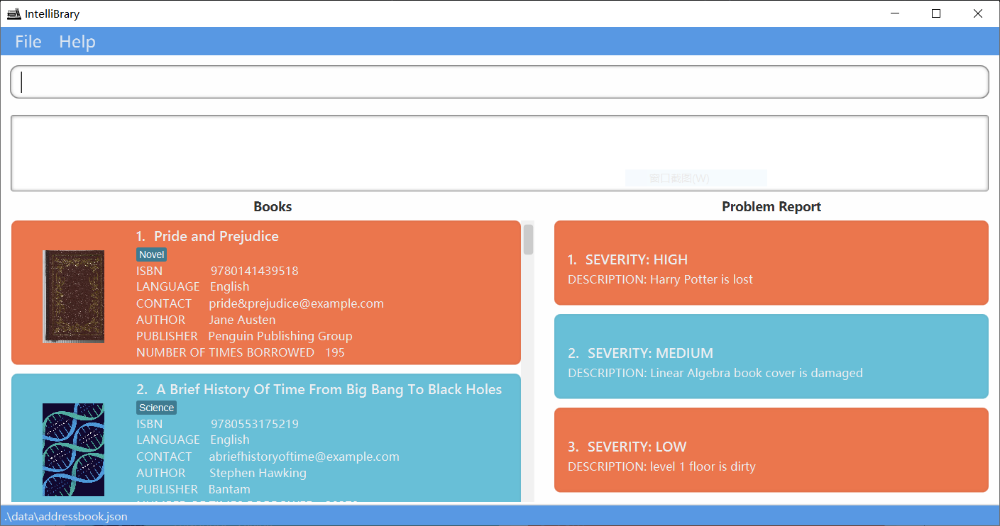
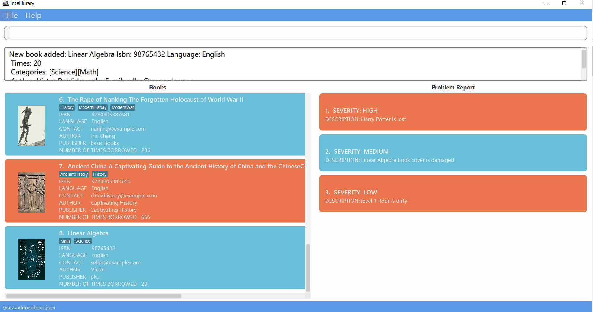
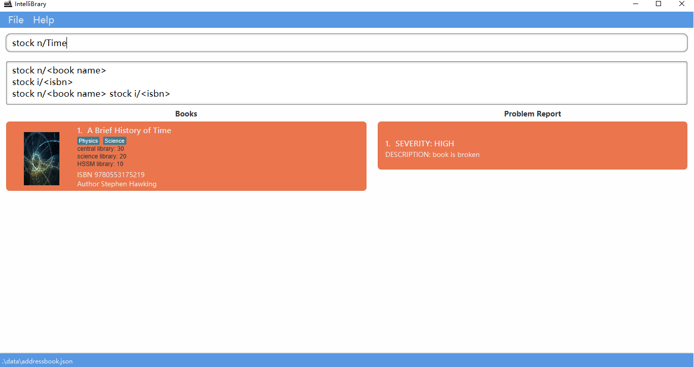
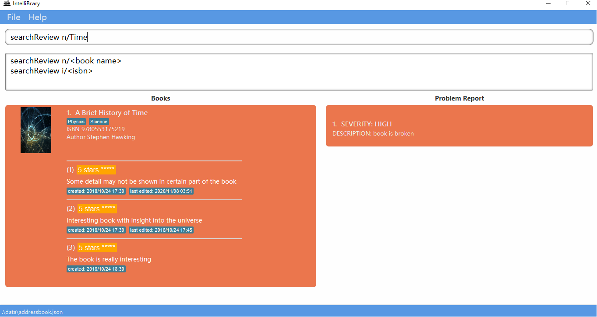
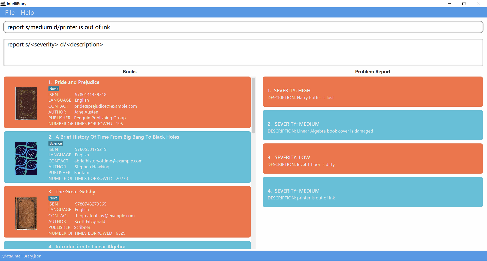
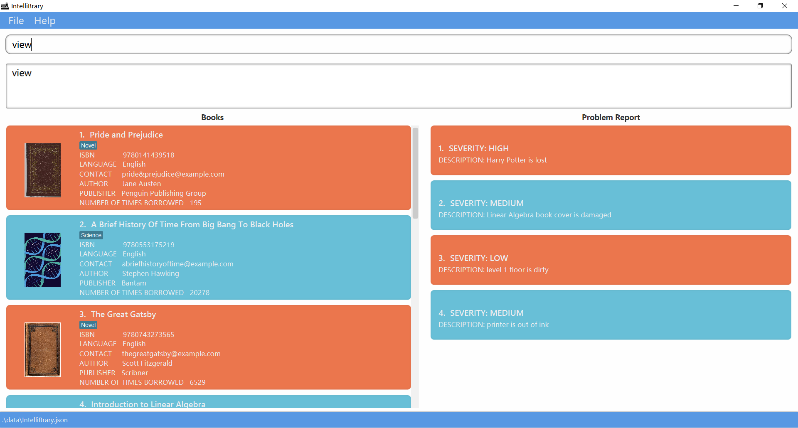
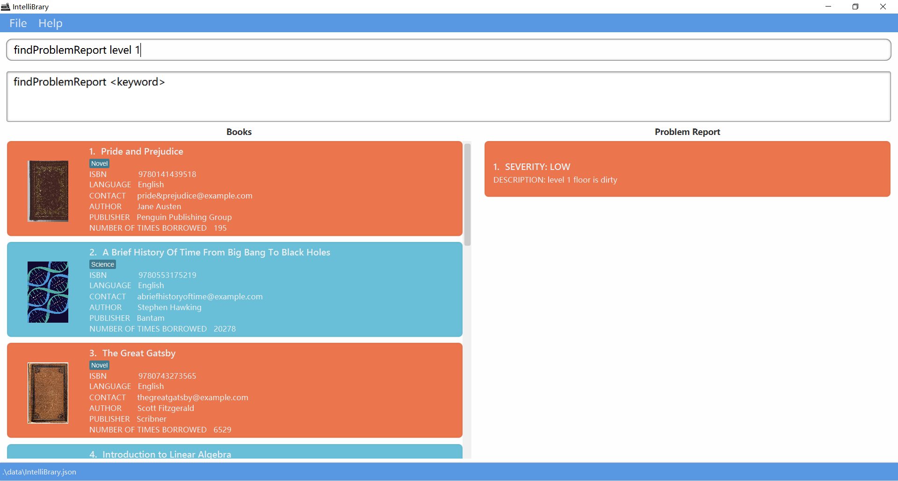

IntelliBrary is an **app for managing storage, purchase, borrowing, reader reviews of books, and logistics in NUS library via a Command Line Interface** (CLI) while still having the benefits of a Graphical User Interface (GUI).
Targeted at users who can type fast, IntelliBrary can get your library management tasks done faster than traditional GUI apps.

* Table of Contents
{:toc}

--------------------------------------------------------------------------------------------------------------------

## Quick start

1. Ensure you have Java `11` or above installed in your Computer.

2. Download the latest `IntelliBrary.jar` from [here](https://github.com/AY2021S1-CS2103-F09-3/tp/releases).

3. Copy the file to the folder you want to use as the _home folder_ for your IntelliBrary.

4. Double-click the file to start the app. The GUI similar to the below should appear in a few seconds. Note how the app contains some sample data.<br>
   

5. Type the command in the command box and press Enter to execute it. e.g. typing **`help`** and pressing Enter will open the help window.<br>
   Some example commands you can try:

   * **`list`** : Lists all books in the library.

   * **`add`**`n/Linear Algebra i/98765432 e/seller@example.com l/English c/Science c/Math t/20 s/centralLb 30 scienceLb 15 a/Victor p/pku` : Adds a Book named `Linear Algebra` to the Library.

   * **`delete`**`3` : Deletes the 3rd book shown in the current list.

   * **`clear`** : Deletes all books and problems.

   * **`exit`** : Exits the app.
   
6. The system will detect user input as you type the command and give smart suggestions as respond even before you hit enter. 
   Note that for *edit* related commands, you can choose to edit as many attributes as you wish at a time.
   For other commands in smart suggestions, only compulsory fields of a command are shown. 
   For readability in app launch, in smart suggestion,
   example formats of usage are provided in lower cases of alphabet. To see full usage details of commands, go to step 7.

7. Refer to the [Features](#features) below for details of all the commands.

--------------------------------------------------------------------------------------------------------------------

## Features

<div markdown="block" class="alert alert-info">

**:information_source: Notes about the command format:**<br>

* Words in `UPPER_CASE` are the parameters to be supplied by the user.<br>
  e.g. in `add n/NAME`, `NAME` is a parameter which can be used as `add n/Linear Algebra`.

* Items in square brackets are optional.<br>
  e.g `n/NAME [c/CATEGORY]` can be used as `n/The Great Gatsby c/Novel` or as `n/The Great Gatsby`.

* Items with `…` after them can be used multiple times including zero times.<br>
  e.g. `[c/CATEGORY]…` can be used as (i.e. 0 times), `c/Novel`, `c/Novel c/Classic` etc.

* Parameters can be in any order.<br>
  e.g. if the command specifies `n/NAME p/PUBLISHER`, `p/PUBLISHER n/NAME` is also acceptable.

</div>

### Basic features

#### View sample data

Have a look at the sample data for the application when opening the app for the first time.


#### View help : `help`

Shows a message about how to access the help page.


Format: `help`

#### Clear all entries : `clear`

_Tentative_ : Clears all entries from the library, including books and problems.

Format: `clear`

#### Exit the program : `exit`

Exits the program.

Format: `exit`

### Features related to library book management

#### List all books : `list`

Shows a list of all books in the library.

Format: `list`

#### Add a book : `add`

Adds a book to the book list.

(Duplicate book will be rejected. Definition of "duplicate" is explained in the following part.)

Format: `add n/NAME i/ISBN e/EMAIL l/LANGUAGE [c/CATEGORY]... t/TIMES s/STOCKINGS a/AUTHOR p/PUBLISHER`

* ```n/``` is followed by the book name, it is case sensitive.
* ```i/``` is followed by the ISBN of the book, which is restricted to numbers, and it should be at least 3 digits long.
* ```e/``` is followed by the email of the book dealer, which shall follow the valid format of email address.
* ```l/``` is followed by the language of the book. It takes in alphabets(spaces not allowed) and should not be blank.
* ```c/``` is the category of the book and is optional. For restrictions on categories, please refer to the detailed explanation in the later category part.
* ```t/``` is followed by the number of times that the book is borrowed, it is restricted to a non-negative integer.
* ```s/``` is followed by the stocking information, stockings at 0 to 3 specified libraries can be added(please refer to the stocking part for more details).
 And the prefix tag ```s/``` is compulsory when adding a book, please refer to the format examples and explanation in stocking part. [Storage format](#storage-examples)
* ```a/``` is followed by the author of the book, it should only contain alphanumeric characters and spaces, and it should not be blank.
* ```p/``` is followed by the publisher of the book, it should only contain alphanumeric characters and spaces, and it should not be blank.

* Duplicate book will be rejected. Duplicate book is judged by the ISBN, as ISBN is the unique identification for books of different versions, editions, and variations.
Thus, we store books separately as long as they have different ISBN, even if they share the same name.

* All prefixes excluding `c/` are compulsory when adding a book, if there are missing prefixes, an error message saying `Invalid command format!` would pop up.
* A space shall always be left before the above attributes prefixes. 

Visual View after entering the first example command:



Examples:
* `add n/Linear Algebra i/98765432 e/seller@example.com l/English c/Science c/Math t/20 s/centralLb 30 scienceLb 15 HSSMLb 10 a/Victor p/pku`

* `add n/Artificial Intelligence i/9780134610993 e/Pearson@example.com l/English c/Science t/20 s/centralLb 2 scienceLb 3 HSSMLb 4 a/Stuart Russell p/PEARSON`

#### Edit a book : `edit`

Edits the information of an existing book in the library.

Format: `edit INDEX [n/NAME] [i/ISBN] [e/EMAIL] [l/LANGUAGE] [t/TIMES] [c/CATEGORY]… [s/STOCKING] [a/AUTHOR] [p/PUBLISHER]`

* Edits the book at the specified `INDEX`. The index refers to the index number shown in the displayed book list. The index **must be a positive integer** e.g, 1, 2, 3...
* All fields are optional but at least one of the optional fields must be provided.
* Existing values will be purged and new values will be written as the newly input values.
* When editing categories, the existing categories of the book will be removed i.e adding of categories is not cumulative.
* You can remove all the book’s categories by typing `c/` without specifying any categories after it.
* Changing the categories of a book can change its book cover. The book cover is for decoration purposes and it is meant to show the category of a book instead of identifying a particular book.

Restrictions:
* ```n/``` is followed by the book name.
* ```i/``` is followed by the ISBN of the book, which is restricted to digits.
* ```e``` is followed by the email of the book dealer, which shall follow the valid format of email address.
* ```l/``` is followed by the language of the book, it should only contain alphabetical characters (spaces are not allowed), and it should not be blank.
* ```c/``` is the category of the book and is optional. For restrictions on categories, please refer to the detailed explanation in the later category part.
* ```t/``` is followed by the number of times that the book is borrowed, it is restricted to a non-negative integer.
* ```s/``` is followed by the stocking information, stockings at 0 to 3 specified libraries can be added (please refer to the stocking part for more details).[Storage format](#storage-examples)
* ```a/``` is followed by the author of the book, it should only contain alphanumeric characters and spaces, and it should not be blank.
* ```p/``` is followed by the publisher of the book, it should only contain alphanumeric characters and spaces, and it should not be blank.

Examples:
* `edit 2 n/A Brief History of Time e/abhot@gmail.com` Edits the name and contact email language of the 2nd book to be A Brief History of Time and abhot@gmail.com respectively.
* `edit 3 p/Scribner Publisher c/` Edits the publisher of the 3rd book to be Scribner Publisher and clears all existing tags.

##### _Additional information regarding stocking in add and edit command_

* The library location name is case sensitive, and the location name needs to match exactly.

* Note that only central library, science library, and HSSM library are available and no stocking information of other library can be added currently.

* Given that there are only 3 locations available, the number of location argument can be at most 3.

* If there are duplicate location argument, such as centralLb 10 centralLb 20, then the later one will shadow the previous one.

* If the stocking information of some of the libraries is not provided or if the number of stocking is 0, then the stocking information shown for the book in that location will be: `Not Available`

* Additionally, to avoid exceeding the library capacity, the stocking of a book in a location should be an integer between 0 and 99999.

* Note that editing the stocking of a book will rewrite the stocking for every location. This means the library location not included in the edit command will be marked as `Not available`

* If multiple `s/` is present, only the information in the last `s/` will be recorded. 

* There are 2 reasons why stocking does not use syntax similar to categories, such as `s/centralLb 40 s/scienceLb 20 s/HSSMLb 30`
    * A book has exactly 1 stocking, which stores all the stocking information of the same book in every location. This is not only appropriate but also necessary because the list of library locations in stocking are specific to libraries in NUS and it is fixed, which is contrary to categories, where user can add new categories dynamically.
    * `s/centralLb 30 scienceLb 20 HSSMLb 10` brings more convenience to the user since there is less work in typing.

##### Storage Examples:
* `s/centralLb 30 scienceLb 20 HSSMLb 10`
* `s/scienceLb 20 HSSMLb 10`
* `s/centralLb 10`

#### Locate books by name: `find`

Finds books whose names contain any of the given keywords.

Format: `find KEYWORD [MORE_KEYWORDS]`

* The search is case-insensitive. e.g `novel` can match `Novel`
* The order of the keywords does not matter. e.g. `Linear Algebra` will match `Algebra Linear`
* Only the book names are searched.
* Only full words will be matched e.g. `Novel` will not match `Novels`
* Books matching at least one keyword will be returned (i.e. `OR` search).
  e.g. `Linear Algebra` will return `Basic Algebra`, `Linear Mathematics`

Examples:
* `find science` returns `Introduction to Science` and `Computer Science`
* `find linear algebra` returns `Basic Algebra`, `linear math`

#### Delete book(s) from the library `delete` and `deleteby`

Deletes the specified book(s) from the library.

##### By its index in the current list `delete`

Format: `delete INDEX`

* Deletes the book at the specified `INDEX`, it is invalid to enter multiple indexes.
* The index refers to the index number shown in the displayed book list.

* The index **must be a positive integer** e.g, 1, 2, 3, …
* If the user input a non-positive integer, an error message indicating `Invalid command format!` would pop up as this is always incorrect.
* If the user input index is larger than the size of the current list, an error message saying `index provided is invalid` would pop up. As this depends on the current list size.


Examples:
* `list` followed by `delete 2` deletes the 2nd book in the library.
* `find novel` followed by `delete 1` deletes the 1st book in the results of the `find` command.

##### By other attributes: `deleteBy`

Delete book(s) from the library.

Format:  
`deleteBy [n/NAME] [i/ISBN] [t/TIMES]` (choose exactly one of the three prefixes in the command)  

* All three prefixes are optional but exactly one of the three prefixes must be selected to delete books that match the command.

* The command allows batch deletion of a list of books. Especially in ```deleteBy t/TIMES```, 
for all the books which the number of times borrowed is fewer or equal to the user input will be deleted.
* Notice: We disallow entering multiple distinct prefixes at a time, the command input is invalid and an error message will pop up.
However, we allow if the user enters multiple same prefixes at a time, only the newest(the last prefix input) will be considered and others are neglected.

Examples:
* `deleteBy n/Linear Algebra`
* `deleteBy i/123456 `

#### Modify the number of times that a book is borrowed `times`

Changes the number of times that a book has been borrowed to the latest record.

Format:  
`times INDEX t/TIMES`

Examples:
* `times 1 t/25` Modifies the number of times the 1st book in the library being borrowed to 25.

#### Check stocking of book in every location: `stock`

Checks the list of stocking information in every location where a certain book is stored.
Currently only the science library, central library, and HSSM library are available locations.
This means only stocking information regarding the science library, central library, and HSSM library are available.

Format: `stock [n/BOOK NAME] [i/ISBN]`

<div markdown="1" class="alert alert-primary">:bulb: **Tip:**

Both the name and the ISBN of the book are optional argument in the command.

If more than one `n/` is present, only the last `n/` will be taken. This is similar for `i/`.

* The book name searching follows the all match pattern, where the search name string will be split into keywords according to the white space in between, and the book name will need to contain all of the keywords in order to be included in the result list.

    * In this case, the word 'contain' means the keyword needs to match exactly a word in the book name. The only difference allowed is that the keyword is case insensitive.
    
     * For example, `The Guns of August` contains `Guns`, but it does not contain `Gun`.
     
     * Executing `stock n/The Guns of August` will return the books whose name contains all of `The`, `Guns`, `of`, and `August`.
    
     * The keyword of book name is case insensitive.

* The ISBN searching follows the partial match pattern, where a ISBN keyword will match all the books whose ISBN contains this keyword.

    * In this case, the word 'contain' means the keyword needs to be a substring of the ISBN of the book.

    * For example, `9780553175219` contains `9780553175219` and `7805`.

The book name string following `n/` needs to follow the format of book name and the ISBN string following `i/` needs to follow the format of ISBN number.

The reason for the design used is that the searching can meet the need of the librarian. The more and the longer the search key is, the more specific the search result will be. 

This will be helpful for librarian, since when doing book purchases, a librarian usually have both the need to check the stocking of all the books and get a summary information, and the need to check the stocking information of a particular book. 

If both the name and the ISBN are used in the command, then the result will be the stocking information of the books that satisfy **both** of the conditions.

If neither of them are present, then the command will return the stocking information of all the books.
</div>

Examples:
* `stock n/A brief history of time`
* `stock i/9780553175219`
* `stock`

Visual Example:



#### Check usage `usage` and `usageBy`

Checks borrowed times of a certain book specified by user. Book is specified by any of the followings:
* one-base index in the book list
* book isbn
* book name

Note that `usageBy` commands are less sensitive and you will need to match exactly book name or isbn to get book usage.

If the index provided is invalid, a message saying `The book index provided is invalid` will be displayed.

If the book specified by isbn or name is not found, a message saying `The book to check is not found` will be displayed.

As checking usage is a comparably simple feature, we suppose you can know the syntax of correctly calling of these commands.
Thus, redundant information will not be provided after you key in invalid input. If you need help, please see in the user guide.

##### By its index in the current list
Format:
* `usage INDEX`

Examples:
* `usage 2`

##### By Book Name or ISBN
Format: 
* `usageBy i/ISBN`
* `usageBy n/BOOK_NAME`

Examples:
* `usageBy i/9780141439518`
* `usageBy n/Pride and Prejudice`

#### Check history: `history`

Checks total borrowing times of all books.

Format: `history`

Examples:
* `history`

#### Random Selection of books `random`

Randomly select a book of a specific category from the library.

Introduction: the `random` command is implemented for librarians for two situations:
1. Random sampling. 

One of the librarians' job is to conduct statistical analysis of the books' data
in the library. For example, a librarian needs to gather data of a certain category of books
(average rating, times borrowed, etc). However, as libraries normally contain tens thousands or millions 
of books, random sampling technique is widely adopted. Thus, the `random` command allows
librarians to randomly select a book from a certain category. This greatly boosts the efficiency and ensures
randomness of random sampling.

2. Random recommendation: 

For a certain category of books, some books may remain in the library without gathering much
attention, which causes waste for the library. Thus, the `random` command allows the 
librarian to pick a random book of a specific 
category and gives every book the same probability to be promoted to public.


Format: `random CATEGORY`

* The category name is matched using case-sensitive approach. For example, `Classics` is different
from `classics`
* If there are no book's category matching the user input, `0 books listed!` will pop up.
* Only one valid category keyword(Categories names should be alphanumeric and should be a single word) is allowed to be entered.

Examples:
* `random Classics`
* `random Science`


#### Find the most popular book of a specific category `findpop`

Find and select the most popular book of a specific category from the library.

Format: `findpop CATEGORY`

* The category name is matched using case-sensitive approach. For example, `Classics` is different
from `classics`
* If there are no books matching the user input, `0 books listed!` will pop up.
* Only one valid category keyword(Categories names should be alphanumeric and should be a single word) is allowed to be entered.

Examples:
* `findpop Classics`
* `findpop Science`

### Features related to Review

#### _Introduction_

The purpose of the review functionality is for librarian to collect and record review and feedback from readers about a certain book, and estimates the general rating and popularity of the book among readers.

Given that review is recorded on a person by person basis, there can be duplicate review added since 2 different people may give the same review.

It is reasonable to assume that most review and feedback is collected anonymously in a library in real life situation.

Additionally, the purpose of recording the review is to estimate the popularity of a certain book among the readers and decide whether the library should keep more copies of the book accordingly, and it is less concerned about what the opinion of a specific reader is.

Therefore, there will be no personal information recorded in the review.

The created time and last edited time in a review refers to the time when the review is recorded and last edited respectively.

The execution of every review command will display the list of review of the books that are involved in the command.

#### Search for review of book: `searchReview`

Check the list of reviews of certain book.

Format: `searchReview [n/BOOK_NAME] [i/ISBN]`

<div markdown="1" class="alert alert-primary">:bulb: **Tip:**

The usage of the prefix `n/` and `i/` in this command is the same as the usage of `n/` and `i/` in the stock command.

The shown review list of the book with no review will be empty.
</div>

Examples:
* `searchReview n/A brief history of time`
* `searchReview i/9780553175219`
* `searchReview`

Visual Example:



#### Add review: `addReview`

Add a review to a certain book. 

Format: `addReview INDEX ra/RATING re/REVIEW_CONTENT`

<div markdown="1" class="alert alert-primary">:bulb: **Tip:**

The book review will be added according to the index of the book in the current shown book list.

The rating needs to be a string representing an integer from 0 to 5.

The review content should not be empty and it should not contain more than 300 characters, excluding the leading and trailing white space.

If more than 1 `ra/` is present, then only the last `ra/` will be used. This is similar for `re/`.

If other command is executed before the add review command, then only the index corresponding to the book shown in the current book list will be valid.

If the index is not in the currently shown book list, then a corresponding exception message will be shown.
</div>

Examples:
* `addReview 1 ra/5 re/The book is interesing`

#### Delete review: `deleteReview`

Delete a review of a certain book.

Format: `deleteReview INDEX rn/REVIEW_INDEX`

<div markdown="1" class="alert alert-primary">:bulb: **Tip:**

If more than 1 `rn/` is present, only the last `rn/` will be used.

The book review will be deleted from the review list of the book according to the index of the book and the index of the review in the review list of the book.

If other command is executed before the delete review command, then only the index corresponding to the book shown in the current book list will be valid.

If the index is not in the currently shown book list, then an exception message will be shown.
</div>

Examples:
* `deleteReview 1 rn/1`

#### Edit review: `editReview`

Edit a review of a certain book. 

Format: `editReview INDEX rn/REVIEW_INDEX [ra/RATING] [re/REVIEW_CONTENT]`

<div markdown="span" class="alert alert-primary">:bulb: **Tip:**

The explanation about index is similar to add review and delete review command.

If neither rating or review content is present, then an exception message will be shown.

If the edited review is the same as the original review, then a corresponding exception message will be shown.

If more than 1 `ra/` is present, then only the last `ra/` will be used. This is similar for `rn/` and `re/`.
</div>

Examples:
* `editReview 1 rn/7 ra/5 re/The book is interesting`
* `editReview 1 rn/7 ra/5`
* `editReview 1 rn/7 re/The book is interesting`

### Features related to problem reports

#### Report problems: `report`

Report a problem found in library.

Format: `report s/SEVERITY d/DESCRIPTION`

Note that `SEVERITY` is limited to `high`, `medium`, and `low`, case-insensitive.

Problem description should only contain alphanumeric characters and spaces, and it should not be blank.

Duplicate problems will be rejected. Note that two problems are considered to be the same if and only if 
they have **both** the same severity and the same description.

Examples:
* `report s/high d/book is broken`


#### View problems: `view`

View all reported problems.

Format: `view`

Examples:
* `view`



#### Locate reports by keyword: `findpr`

Finds reports whose descriptions contain any of the given keywords.

Format: `findpr KEYWORD [MORE_KEYWORDS]`

* The search is case-insensitive. e.g `chair` will match `Chair`
* The order of the keywords does not matter. e.g. `table chair` will match `chair table`
* Only the description of a problem report is searched.
* Only full words will be matched e.g. `chair` will not match `chairs`
* Report descriptions matching at least one keyword will be returned (i.e. `OR` search).
  e.g. `table chair` will return `chair light`, `light table`

Visual View of finding problem reports that are related to `level 1`:



Examples:
* `findpr chair` returns report containing `chair` and `fix chair`
* `findpr table chair` returns `table`, `chair`

#### Delete a report : `deletepr`

Deletes the specified problem report from library management system.

Format: `deletepr INDEX`

* Deletes the report at the specified `INDEX`.
* The index refers to the index number shown in the displayed problem report list.
* The index **must be a positive integer** 1, 2, 3, …
* If the user input a non-positive integer, an error message saying `Invalid command format!` would pop up as the command format is always invalid.
* If the user input index is larger than the size of the current list, an error message saying `index provided is invalid` would pop up. 


Examples:
* `findpr chair` followed by `deletepr 1` deletes the 1st report in the results of the `findpr` command.`
* `findpr table` followed by `deletepr 2` deletes the 2nd report in the results of the `findpr` command.`

#### Edit a problem report : `editpr`

Edits the information of an existing problem report in the library.

Format: `editpr INDEX [s/SEVERITY] [d/DESCRIPTION]`

* Edits the report at the specified `INDEX`. The index refers to the index number shown in the displayed report list. The index **must be a positive integer** 1, 2, 3...
* All fields are optional but at least one of the optional fields must be provided.
* Existing values will be updated to the input values.

Examples:
* `editpr 2 s/high d/light at the first floor is broken` Edits the severity and description of the 2nd report in the current report list.
* `editpr 3 s/low` Edits the severity of the 3rd report in the current report list.

--------------------------------------------------------------------------------------------------------------------

## Additional information regarding categories and book cover

The book cover is for decoration purposes and it is meant to show the category of a book instead of identifying a particular book.

The list of relevant categories are given below in ascending order with respect to the priority of the category.

Note that categories that are not in the list is still a valid category, but they will not help to give a specific book cover to the book.

* `General`
* `Novel`
* `History`
* `Science`
* `AncientHistory`
* `ModernHistory`
* `AncientWar`
* `ModernWar`
* `Math`
* `Chemistry`
* `Physics`

The book cover of a book depends on the categories of the book(implemented in case-insensitive way), but the category name needs to match **exactly**, and there cannot be white space in between the category words.

The following are **invalid** examples of category which will not reflect the intention of the user of adding the `ModernWar` category to the book.

* `Modern war`
* `Modern war in Asia`
* `ModernWar in Asia`
* `ModernWars`

If more than 1 category is given, the book cover will depend on the category with higher priority.

If no category is given or none of the categories given is in the list above, then the book will have a book cover corresponding to the general category.

For example, the book with categories Physics and Science will have a book cover corresponding to Physics

To make the book cover more diversified, 2 books with the same categories may have different book cover corresponding to the categories, but they may also have the same book cover.

--------------------------------------------------------------------------------------------------------------------

## Command summary

Commands are listed in alphabetical order.

Action | Format, Examples
--------|------------------
**Add** | `add n/NAME i/ISBN e/EMAIL l/LANGUAGE [c/CATEGORY]...t/TIMES s/STOCKINGS a/AUTHOR p/PUBLISHER` <br> e.g., `add n/Linear Algebra i/98765432 e/xxxxxx@example.com l/English c/Science c/Math t/20 s/centralLb 30 scienceLb 15 a/Victor p/pku`
**AddReview** | `addReview INDEX ra/RATING re/REVIEW_CONTENT` <br> e.g., `addReview 1 ra/5 re/The book is interesing`
**Clear** | `clear`
**Delete** | `delete INDEX`<br> e.g., `delete 3`
**DeleteBy** | `deleteBy [n/NAME] [i/ISBN] [t/TIMES]`(one prefix must be selected) <br> e.g., `deleteBy n/Linear Algebra`
**DeleteProblemReport** | `deletepr INDEX` <br> e.g., `deletepr 1`
**DeleteReview** | `deleteReview INDEX rn/REVIEW_INDEX` <br> e.g., `deleteReview 1 rn/1`
**Edit** | `edit INDEX [n/NAME] [i/ISBN] [e/EMAIL] [l/LANGUAGE] [t/TIMES] [c/CATEGORY]… [s/STOCKING] [a/AUTHOR] [p/PUBLISHER]`<br> e.g.,`edit 3 p/Scribner Publisher c/`
**EditProblemReport** | `editpr INDEX [s/SEVERITY] [d/DESCRIPTION]` <br> e.g., `editpr 2 s/high d/light at the first floor is broken`
**EditReview** | `editReview INDEX rn/REVIEW_INDEX [ra/RATING] [re/REVIEW_CONTENT]` <br> e.g., `editReview 1 rn/7 ra/5 re/The book is interesting`
**Exit** | `exit`
**Find** | `find KEYWORD [MORE_KEYWORDS]`<br> e.g., `find James Jake`
**FindMostPopular** | `findpop CATEGORY` <br> e.g., `findpop Science`
**FindProblemReport** | `findpr KEYWORD [MORE_KEYWORDS]` <br> e.g., `findpr chair`
**Help** | `help`
**History**| `history`
**List** | `list`
**Random** | `random CATEGORY` <br> e.g., `random Classics`
**ReportProblem** | `report s/SEVERITY d/DESCRIPTION` <br> e.g., `report s/medium d/book is broken`
**SearchReview** | `searchReview [n/BOOK NAME] [i/ISBN]` <br> e.g., `searchReview n/A brief history of time`
**Stock** | `stock [n/BOOK NAME] [i/ISBN]` <br> e.g., `stock n/A brief history of time i/9780553175219`
**Times**| `times INDEX t/TIMES` <br> e.g., `times 1 t/5`
**Usage**| `usage INDEX` <br> e.g., `usage 1`
**UsageBy**| `usageBy i/ISBN` `usageBy n/BOOK_NAME` <br> e.g., `usageBy i/9780141439518` `usageBy n/Pride and Prejudice`
**ViewProblems** | `view`
