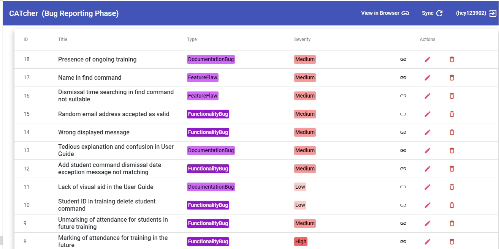

## Project: IntelliBrary

IntelliBrary is a desktop library management application used for library administrators to manage books. The user interacts with it using a CLI, and it has a GUI created with JavaFX. It is written in Java, and has about 10 kLoC.

Given below are my contributions to the project.

* **Code contributed**: [RepoSense link](https://nus-cs2103-ay2021s1.github.io/tp-dashboard/#breakdown=true&search=hcy123902&sort=groupTitle&sortWithin=title&since=2020-08-14&timeframe=commit&mergegroup=&groupSelect=groupByRepos&checkedFileTypes=docs~functional-code~test-code~other)

* **Project management**:
  * Opened Milestone v1.4
  
* **Enhancements to existing features**:
  * Create model: `Review`
    * Proposed and created the `Review` model to describe the review and rating collected for a certain book.
    * Created the `Rating`, `ReviewContent`, and `ReviewNumber` to describe the detail of a review.
    * Added the user interface component `LibraryBookDetailReviewCard` which shows the list of review of a book.
    * Added the user interface component `BookReviewCard` which shows a single review of a book.
  * Add attribute `Stocking`
    * Proposed and added the `Stocking` attribute to `Book` to describe the stocking information of a book in every library location.
    * Added the user interface component `LibraryBookDetailStockingCard`  to `Book` to show the stocking information with a different book card, where the unrelated information, such as number of times that a book has been borrowed, is not shown as compared with the original book card.
  * Add feature: view the `Stocking` of a book
    * Implemented the `stock` command in `StockCommand.java` and `StockCommandParser.java`, and made changes to other related document such as `ParseUtil.java` and `AddressBookParser.java`
  * Add feature: search for the `Review ` of a book
    * Implemented the `searhReview` command in `SearchReviewCommand.java` and `SearchReviewCommandParser.java`
  * Add feature: add the `Review ` to the review list of a book
    * Implemented the `addReview` command in `AddReviewCommand.java` and `AddReviewParser.java`
  * Add feature: delete the `Review ` to the review list of a book
    * Implemented the `deleteReview` command in `DeleteReviewCommand.java` and `DeleteReviewParser.java`
  * Add feature: edit the `Review ` to the review list of a book
      * Implemented the `editReview` command in `EditReviewCommand.java` and `EditReviewParser.java`
  * Add book cover
    * Added the `BookCoverManager` and selects the book cover for a book based on the category of the book.
    * Added the user interface component `BookCardWithCover` which shows the information of a book with the book cover.

* **Documentation**:
  * User Guide:
    * Added explanation about the association between the `BookCover` and the category of the book.
    * Added explanation about the format of `Stocking` in the `add` command.
    * Added explanation about the purpose of the `Review` functionality and its usage for the user of the application.
    * Added documentation about the usage of `stock` command
    * Added documentation about the usage of `searchReview`, `addReview`, `deleteReview`, and `editReview` command
  * Developer Guide:
    * Specified the target user profile regarding librarian
    * Added the first 9 user stories
    * Added implementation details about stocking.
    * Added the Class Diagram to explain the association between `Book` and `Stocking`
    * Added Sequence Diagram for the parsing of the `Stocking` model in `add` command 
    * Added the Sequence diagram for the parsing and execution of the `stock` command
    * Specified the use cases UC05, UC06, UC07, UC08, UC09, and UC10.

* **Contributions to the Team-Based Tasks**:
    * Wrote the target user profile and specified what the library management task is in the Developer Guide
    * Helped to wrote the command summary in User Guide
    * Opened Milestone v1.4
    * Provided technical suggestion for calculating the total number of times when a certain group of books is borrowed in the History command using `getFilteredBookList` and `getLibrary`
    * Helped to solve technical issues regarding RepoSense contribution detection in week 12, and provided suggestion to use `git reset` to set the state of the upstream master branch to a previous state. This corrects the contribution reflected by the RepoSense platform.
    * Notified the team members to update the UML Diagram, implementation details of features, and use cases in the Developer Guide before milestone v1.3 mid and v1.4
    * Maintained the issue tracker and closed issues when they are solved

* **Review contributions**:
    * [PR1](https://github.com/AY2021S1-CS2103-F09-3/tp/pull/21)
    * [PR2](https://github.com/AY2021S1-CS2103-F09-3/tp/pull/64)
    * [PR3](https://github.com/AY2021S1-CS2103-F09-3/tp/pull/73)
    * [PR4](https://github.com/AY2021S1-CS2103-F09-3/tp/pull/78)
    * [PR5](https://github.com/AY2021S1-CS2103-F09-3/tp/pull/90)
    * [PR6](https://github.com/AY2021S1-CS2103-F09-3/tp/pull/91)
    * [PR7](https://github.com/AY2021S1-CS2103-F09-3/tp/pull/134)

* **Contributions beyond the project team**

Reported the documentation, functionality, and feature problems for the project from CS2103-F10-1

* **Contributions to the User Guide**

Each section below is an extract of the original section in the User Guide. Please see the User Guide for the full content in that section.

##### Regarding categories and book cover
The list of relevant categories are given below in ascending order with respect to the priority of the category.

Note that categories that are not in the list is still a valid category, but they will not help to give a specific book cover to the book.

`General` `Novels` `History` `Science` `AncientHistory` `ModernHistory` `AncientWar` `ModernWar` `Math` `Chemistry` `Physics`

The book cover of a book depends on the categories of the book.

The category name is case insensitive, but there cannot be white space in between the category words.

##### Check stocking of book in every location: `stock`

Checks the list of locations of where a certain book is stored.
Currently only the science library, central library, and HSSM library are available locations.
This means only stocking information regarding the science library, central library, and HSSM library are available.

Format: `stock [n/BOOK NAME] [i/ISBN]`

Examples:
* `stock n/A brief history of time i/9780553175219`
* `stock n/A brief history of time`
* `stock i/9780553175219`
* `stock`

##### Additional notes about review

The purpose of the review functionality is for librarian to collect and record review and feedback from readers about a certain book, and estimates the general rating and popularity of the book among readers.

The purpose of recording the review is to estimate the popularity of a certain book among the readers and decide whether the library should keep more copies of the book accordingly, and it is less concerned about what the opinion of a specific reader is.

Therefore, will be no personal information recorded in the review.

##### Search for review of book: `searchReview`

Check the list of reviews of certain book.

Format: `searchReview [n/BOOK NAME] [i/ISBN]`

:bulb: **Tip:**

The usage is similar to the stock command.

Examples:
* `searchReview n/A brief history of time i/9780553175219`
* `searchReview n/A brief history of time`
* `searchReview i/9780553175219`
* `searchReview`

##### Add review: `addReview`

Examples:
* `addReview 1 ra/5 re/The book is interesing`

Add a review to a certain book. 

Format: `addReview INDEX ra/RATING re/REVIEW_CONTENT`

##### Delete review: `deleteReview`

Delete a review of a certain book.

Format: `deleteReview INDEX rn/REVIEW_INDEX`

Examples:
* `deleteReview 1 rn/1`

##### Edit review: `editReview`

:bulb: **Tip:**

The explanation about index is similar to add review and delete review command.

If neither rating or review content is present, then an exception message will be shown.

If the edited review is the same as the original review, then a corresponding exception message will be shown. 

Examples:
* `editReview 1 rn/7 ra/5 re/The book is interesing`
* `editReview 1 rn/7 ra/5`
* `editReview 1 rn/7 re/The book is interesing`

* **Contributions to the Developer Guide**

The relationship between the book and the stocking and other components

The creation of the stocking

The creation of the stocking

    